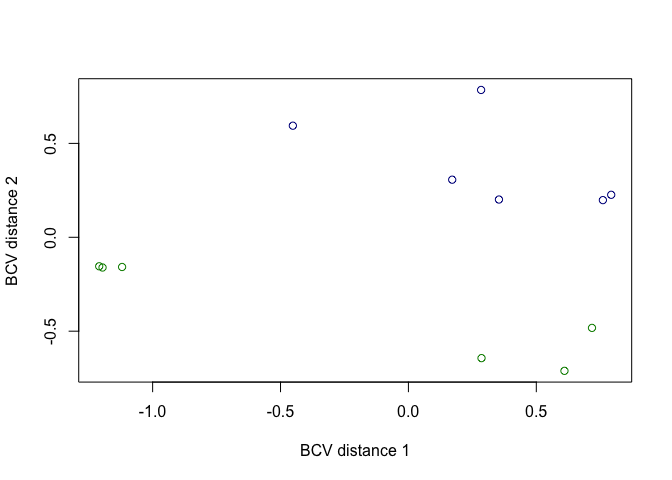
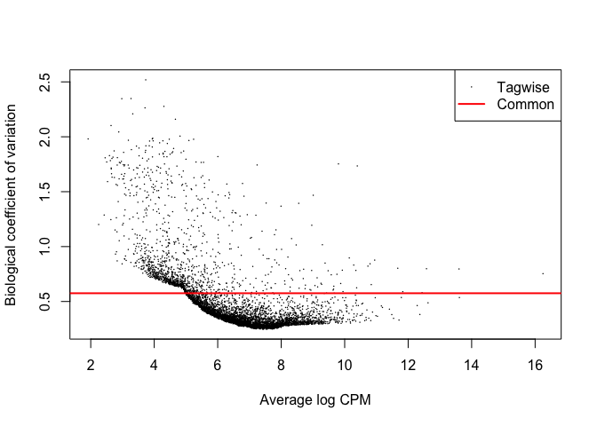
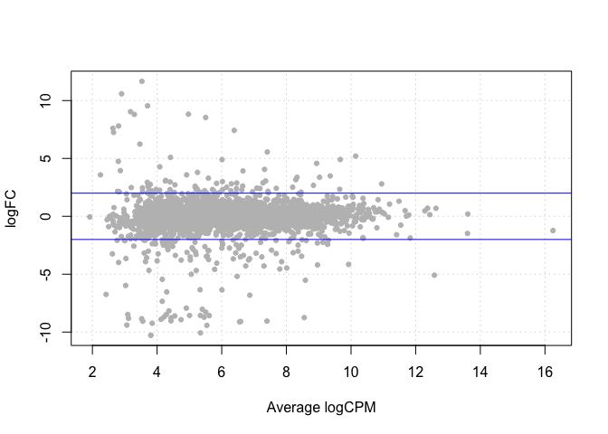
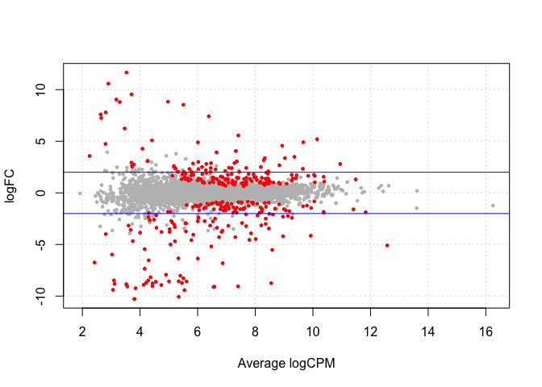
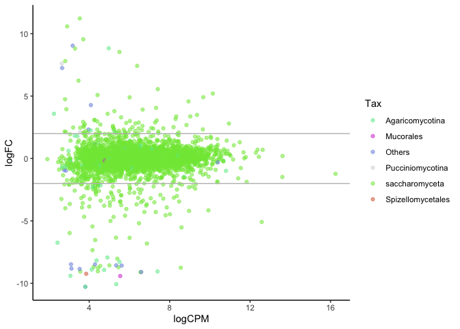

# The dual nature of lichens: a transcriptomic approach to understand photomorphism

This R Markdown file includes 17 scripts used namely for collapsing and filtering [Trinity](https://github.com/trinityrnaseq/trinityrnaseq/wiki) transcripts that have been analyzed using [Transdecoder](https://github.com/TransDecoder/TransDecoder) to derive protein (ORF) predictions, analyzed using [Bowtie 2](http://bowtie-bio.sourceforge.net/bowtie2/index.shtml) and [eXpress](https://pachterlab.github.io/eXpress/) to generate transcriptome-specific abundance estimates. Finally, differential expression between photomorphs was analyzed using [edgeR](https://bioconductor.org/packages/release/bioc/html/edgeR.html). All these steps are succintly described in Materials and Methods of the above paper.

Some steps require a great deal of memory (RAM) and may take a few days to run. A computer cluster with high memory nodes was used for several scripts; these steps are denoted by the symbol "&#9653;".

The data consists of twelve libraries treated under two different \textcolor{red}{red} conditions and using an **poly(A) RNA selection** protocol:

* Cyanomorph (AS1, AS2, AS8, AS9, AS11, AS12)
* Chloromorph (AS3, AS4, AS5, AS6, AS7, AS10)

## Table of Contents
* [Quality filtering using Trimmomatic](#1)  
* [De novo assembling the Illumina reads](#2)  
* [Identifying the Coding Regions](#3)  
* [Aligning the translated ORFs against the protein database](#4)  
* [Formatting the outputs](#5)  
* [Retrieving the longest transcripts](#6)  
* [Pulling out the ORF labels that match the longest transcripts](#7)  
* [Retrieving the optimal ORFs](#8)  
* [Generating a file with the optimal non-translated transcripts](#9)  
* [Generating transcriptome-specific abundance estimates](#10)  
* [Obtaining the “total transcript reads” counts per transcript](#11)  
* [Combining total read counts and DIAMOND output](#12)  
* [Translating taxid numbers into lineages](#13)  
* [Creating taxonomic subsets](#14)  
* [Performing differential expression analysis](#15)  
* [Creating an input file suitable for functional annotation](#16)  
* [Combining Gene Ontology (GO) and differential expressed genes (DEG)](#17)  

## Quality filtering using Trimmomatic<sup>&#9653;</sup> 
<a name="1"/>
The following script performs quality trimming on the Illumina libraries with the program [Trimmomatic](http://www.usadellab.org/cms/?page=trimmomatic) using a quality cut-off of 15 in a 4-bp sliding window, discarding any reads under 36 bp. Only paired, trimmed reads were used in downstream scripts.

Additionally, in order to counter the sequence content bias attributed to random hexamer priming from PCR amplification, we clipped the first 12 bases from 5' ends using [FASTX-Toolkit](http://hannonlab.cshl.edu/fastx_toolkit/) in all libraries.


```bash
# bash
for i in "AS1" "AS2" "AS3" "AS4" "AS5" "AS6" "AS7" "AS8" "AS9" "AS10" "AS11" "AS12"; 
do
java -jar $Trimmomatic \
        PE \
        -phred33 \
        "$i"_1.fq  "$i"_2.fq "$i"_1_trimmed "$i"_1_unpaired.fq "$i"_2_trimmed.fq "$i"_2_unpaired.fq \
        ILLUMINACLIP:/home/antoine_simon/prog/Trimmomatic-0.35/adapters/TruSeq3-PE-2.fa:2:30:10 LEADING:3 TRAILING:3 SLIDINGWINDOW:4:15 MINLEN:36

fastx_trimmer -f 12 -i "$i"_1_trimmed.fq -o trimmomatic_minus12/"$i"_1.fq -Q33
fastx_trimmer -f 12 -i "$i"_2_trimmed.fq -o trimmomatic_minus12/"$i"_2.fq -Q33

done

```

## De novo assembling the Illumina reads<sup>&#9653;</sup> 
<a name="2"/>
We assembled all four quality-filtered Illumina libraries into a single pooled assembly using [Trinity](https://github.com/trinityrnaseq/trinityrnaseq/wiki). We use a minimum length cutoff value of 400 bp. Assembly statistics are presented in the table hereafter.


```bash
# bash
module load trinity/2.6.6
module load bowtie2/2.3.3.1
module load samtools
module load perl/5.28.1 

Trinity --seqType fq --left trimmomatic_minus12/AS1_1.fq,trimmomatic_minus12/AS2_1.fq,trimmomatic_minus12/AS3_1.fq,trimmomatic_minus12/AS4_1.fq,trimmomatic_minus12/AS5_1.fq,trimmomatic_minus12/AS6_1.fq,trimmomatic_minus12/AS7_1.fq,trimmomatic_minus12/AS8_1.fq,trimmomatic_minus12/AS9_1.fq,trimmomatic_minus12/AS10_1.fq,trimmomatic_minus12/AS11_1.fq,trimmomatic_minus12/AS12_1.fq --right trimmomatic_minus12/AS1_2.fq,trimmomatic_minus12/AS2_2.fq,trimmomatic_minus12/AS3_2.fq,trimmomatic_minus12/AS4_2.fq,trimmomatic_minus12/AS5_2.fq,trimmomatic_minus12/AS6_2.fq,trimmomatic_minus12/AS7_2.fq,trimmomatic_minus12/AS8_2.fq,trimmomatic_minus12/AS9_2.fq,trimmomatic_minus12/AS10_2.fq,trimmomatic_minus12/AS11_2.fq,trimmomatic_minus12/AS12_2.fq --CPU 16 --output trinity/AStotal --min_contig_length 300 --JM 250G

```

Then, *TrinityStats.pl*, a utility program provided with [Trinity](https://github.com/trinityrnaseq/trinityrnaseq/wiki), was used to assess the overall quality of the assembly.


```bash
# bash

cat TrinityStats.txt

```

```
## 
## ################################
## ## Counts of transcripts, etc.
## ################################
## Total trinity 'genes':	339573
## Total trinity transcripts:	412618
## Percent GC: 49.20
## 
## ########################################
## Stats based on ALL transcript contigs:
## ########################################
## 
## 	Contig N10: 6535
## 	Contig N20: 4363
## 	Contig N30: 3031
## 	Contig N40: 2100
## 	Contig N50: 1349
## 
## 	Median contig length: 435
## 	Average contig: 846.31
## 	Total assembled bases: 349201263
## 
## 
## #####################################################
## ## Stats based on ONLY LONGEST ISOFORM per 'GENE':
## #####################################################
## 
## 	Contig N10: 4051
## 	Contig N20: 2247
## 	Contig N30: 1325
## 	Contig N40: 859
## 	Contig N50: 627
## 
## 	Median contig length: 408
## 	Average contig: 624.86
## 	Total assembled bases: 212184046
```

# Identifying the Coding Regions<sup>&#9653;</sup>

Open reading frames (ORFs) from the pooled transcriptome assembly were calculated using [Transdecoder](https://github.com/TransDecoder/TransDecoder), resulting 368,720 ORFs.


```bash
# bash

module load /isg/shared/modulefiles/TransDecoder/3.0.1
module load /isg/shared/modulefiles/hmmer/3.1b2

mkdir transdecoder
cd transdecoder

#First we use the TransDecoder utility to run on the pooled transcriptome assembly.
TransDecoder.LongOrfs -t ../trinity/AStotal/Trinity.fasta

#Then we identify ORFs with homology to known proteins via pfam search; this maximizes the sensitivity for capturing the ORFs that have functional significance
hmmscan --cpu 16 --domtblout pfam.domtblout /isg/shared/databases/Pfam/Pfam-A.hmm Trinity.fasta.transdecoder_dir/longest_orfs.pep 

#Finally, we predict the likely coding regions using the Pfam search output
TransDecoder.Predict -t ../trinity/AStotal/Trinity.fasta --retain_pfam_hits pfam.domtblout --cpu 16

```

# Aligning the translated ORFs against the protein database<sup>&#9653;</sup>

Translated ORFs were then blasted against the NCBI non-redundant (nr) database using the [DIAMOND](https://github.com/bbuchfink/diamond) BLASTP search (protein versus protein) in order to generate taxonomic assignments.


```bash
# bash

module load /isg/shared/modulefiles/diamond/0.9.9

diamond blastp -d ~/tempdata3/antoine/nt_diamond/nr -q /home/CAM/asimon/transdecoder_continued/Trinity.fasta.transdecoder.pep  -o ~/tempdata3/antoine/DIAMOND/diamond_ALL2.txt --taxonmap ~/home/antoine_simon/database/prot.accession2taxid.gz -e 1e-6 -p 8 -f 6 qseqid sseqid pident length mismatch gapopen qstart qend sstart send evalue bitscore staxids -k 1

```

# Formatting the outputs

In the following chunk, the outputs of [DIAMOND](https://github.com/bbuchfink/diamond), [Transdecoder](https://github.com/TransDecoder/TransDecoder) and [Trinity](https://github.com/trinityrnaseq/trinityrnaseq/wiki) are slightly modified so that they can be used in the subsequent Python scripts: the two interleaved fasta files are converted into single line fasta files, and the identifiers within the Diamond output are shortened.


```bash
# bash

cd /Users/antoinesimon/Documents/Dendriscosticta/transcriptomics/NoteBook_AS/

# Trinity.fasta.transdecoder.pep: convert the multiline fasta to a single line fasta, then only keep the identifier
awk '/^>/ {printf("\n%s\n",$0);next; } { printf("%s",$0);}  END {printf("\n");}' < Trinity.fasta.transdecoder.pep | sed '1d' | awk 'NR%2==1' > Transdecoder_identifier.pep

# Trinity.fasta: convert the multiline fasta to a single line fasta, then only keep the identifier
awk '/^>/ {printf("\n%s\n",$0);next; } { printf("%s",$0);}  END {printf("\n");}' < Trinity.fasta > Trinity_1.fasta
sed '1d' Trinity_1.fasta | awk 'NR%2==1' > Trinity_identifier.fasta

# Number of rows in Trinity_identifier.fasta; you have to modify the following python script accordingly.
wc -l Trinity_identifier.fasta

# Modify the Diamond file: e.g., "TRINITY_DN10003_c0_g1::TRINITY_DN10003_c0_g1_i2::g.236161::m.236161" in "g.236161"
sed -E 's/^[^:]*::[^:]*::([^:]*)::m\.[0-9]*/\1/g' diamond_ALL2.txt > Diamond_int.txt

```

# Retrieving the longest transcripts<sup>&#9653;</sup>

The three following Python scripts aim to retrieve the transcripts with the highest e-value over all ORFs or the first ORF with a blast e-value of zero on the longest splicing isoform per contig (modified versions from [Spribille *et al.* 2016](https://science.sciencemag.org/content/353/6298/488)).
If you happen to use these chunks of code in your research, please cite the following paper:

Spribille, T., Tuovinen, V., Resl, P., Vanderpool, D., Wolinski, H., Aime, M.C., Schneider, K., Stabentheiner, E., Toome-Heller, M., Thor, G., Mayrhofer, H., Johannesson, H., McCutcheon, J.P. (2016). Basidiomycete yeasts in the cortex of ascomycete macrolichens. *Science* 253, 488-492.

The following script retrieves the longest transcript (splicing isoform) from a set of [Trinity](https://github.com/trinityrnaseq/trinityrnaseq/wiki) transcripts assigned to a single component.


```python
# python script

#The input file should look like the following (or the script can be modified to take some variation thereof):
# [stripped out fasta headers:]
#>c1639_g1_i1 len=370 path=[1:0-369]
#>c1639_g2_i1 len=574 path=[1246:0-573]
#>c1640_g1_i1 len=395 path=[171:0-26 170:27-394]
#>c1647_g1_i1 len=304 path=[33:0-47 32:48-303]

infilename = "Trinity_identifier.fasta"
infile = open(infilename, 'r')
infile_ncols = 1
infile_nrows = 412618

outfilename = "comp_lens.targets.longest_only.txt"
OUT = open(outfilename, 'w')

import re
import sets

def recognize_comp(input_string):
	SearchStr = '(c\d+_g\d+)_i\d+'
	Result = re.search(SearchStr, input_string)
	return (Result.group(1))
	

def recognize_seq(input_string):
	SearchStr = '(c\d+_g\d+_i\d+)'
	Result3 = re.search(SearchStr, input_string)
	return (Result3.group(1))


def recognize_len(input_string2):
	SearchStr2 = 'len=(\d+)'
	Result2 = re.search(SearchStr2, input_string2)
	return (Result2.group(1))


linenumber = 0
comp_len_crosswalk  = [[0 for x in xrange(infile_nrows)]for x in xrange(4)]
for line in infile:
	if linenumber >= 0:
		line = line.strip('\n')
		elementlist = line.split('\t')
		i = 0
		for element in elementlist:
			comp_len_crosswalk[0][linenumber] = element
			comp_len_crosswalk[1][linenumber] = recognize_comp(str(element))
			comp_len_crosswalk[2][linenumber] = recognize_seq(str(element))			
			comp_len_crosswalk[3][linenumber] = recognize_len(str(element))
	linenumber = linenumber + 1

cl = comp_len_crosswalk[1]
contigs = list(set(cl))

len = 0
for contig in contigs:
	if contig != 0:
		print "For contig: ", contig
		len = 0
		for index in range(0, infile_nrows):
			current_contig = comp_len_crosswalk[1][index]
			if current_contig == contig:
				if int(comp_len_crosswalk[3][index]) >= len:
					len = int(comp_len_crosswalk[3][index])
					transcript = comp_len_crosswalk[2][index]
					my_index = index
		if len != 0:
			print "...and the longest transcript is: ", transcript, "with", len, "bases!"
			OutputString = "%s\t%s\t%s"  % (contig, transcript, len)						
			OUT.write(OutputString+'\n')


infile.close()
OUT.close()
```

# Pulling out the ORF labels that match the longest transcripts<sup>&#9653;</sup>

In the following script, we retrieve all the ORF labels that match the longest transcripts based on a list of ORF identifiers (e.g., the output by [Transdecoder](https://github.com/TransDecoder/TransDecoder)) and a list of the longest transcripts per [Trinity](https://github.com/trinityrnaseq/trinityrnaseq/wiki) component (e.g., the output of the previous script).


```python
# python script

#The input file should look like the following:
# [stripped out fasta headers:]
#>Gene.66844::c100013_g1_i1::g.66844::m.66844 Gene.66844::c100013_g1_i1::g.66844  ORF type:internal len:168 (+) #c100013_g1_i1:1-501(+)
#>Gene.66846::c100013_g1_i2::g.66846::m.66846 Gene.66846::c100013_g1_i2::g.66846  ORF type:internal len:134 (-) #c100013_g1_i2:1-399(-)

infilename = "Transdecoder_identifier.pep"
infile = open(infilename, 'r')
infile_ncols = 1
infile_nrows = 368720 ##### changer

infile2name = "comp_lens.targets.longest_only.txt"
infile2 = open(infile2name, 'r')
infile2_ncols = 3
infile2_nrows = 339573 ##### changer

outfilename = "target_orfs.from_longest_only.txt"
OUT = open(outfilename, 'w')


import re
import sets

def recognize_sequence(input_string):   
	SearchStr = '\s(c\d+_g\d+_i\d+)'
	Result = re.search(SearchStr, input_string)
	return (Result.group(1))

def recognize_orf(input_string2):
	SearchStr2 = '>(Gene.\d+)::'
	Result2 = re.search(SearchStr2, input_string2)
	return (Result2.group(1))


linenumber = 0
all_orfs  = [[0 for x in xrange(infile_nrows)]for x in xrange(3)]
for line in infile:
	if linenumber >= 0:
		line = line.strip('\n')
		elementlist = line.split('\t')
		i = 0
		for element in elementlist:
			all_orfs[0][linenumber] = element
			all_orfs[1][linenumber] = recognize_orf(str(element))
			all_orfs[2][linenumber] = recognize_sequence(str(element))
	linenumber = linenumber + 1


linenumber = 0
longest_transcripts  = [[0 for x in xrange(infile2_nrows)]for x in xrange(infile2_ncols)]
for line in infile2:
	if linenumber >= 0:
		line = line.strip('\n')
		elementlist = line.split('\t')
		i = 0
		for element in elementlist:
			longest_transcripts[i][linenumber] = element
			i += 1
	linenumber = linenumber + 1

ls = longest_transcripts[1]
long_seqs = list(set(ls))

cs = all_orfs[2]
core_seqs = list(set(cs))

elem1 = [x for x in long_seqs]
elem2 = [x for x in core_seqs]

target_seq_list = []
for item in elem1:
    if item in elem2:
        print 'found', item
        target_seq_list.append(item)
        print len(target_seq_list)

target_orf_list = []
for seq in target_seq_list:
	for index in range(0, infile_nrows):
		current_seq = all_orfs[2][index]
		if seq == current_seq:
			orf = all_orfs[1][index]
			cus = all_orfs[2][index]
			target_orf_list.append(orf)
			print len(target_orf_list)
			print seq, orf
			OutputString = "%s\t%s"  % (seq, orf)						
			OUT.write(OutputString+'\n')

infile.close()
OUT.close()
```

# Retrieving the optimal ORFs<sup>&#9653;</sup>

This script takes the output of a blastp query of [Transdecoder](https://github.com/TransDecoder/TransDecoder) predicted proteins and matches up [DIAMOND](https://github.com/bbuchfink/diamond) results with the ORF list produced in the previous script, leaving only the ORF with the best e-value or the first ORF per transcript to have an e-value of zero.


```python
# python script

#The input formats should be like:
# [Blast fmt6 output file with taxid annotation (last column)]
#
#Gene.66837::c100001_g1_i1::g.66837::m.66837	XP_013271523.1	51.5	101	49	0	1	101	929	1029	7.4e-21	109.0	1442369
#Gene.66838::c100004_g1_i1::g.66838::m.66838	XP_002838600.1	65.8	184	53	2	69	249	30	206	7.1e-60	240.0	#39416;656061


infilename = "Diamond_int.txt"
infile = open(infilename, 'r')
infile_ncols = 13
infile_nrows = 228074  #there are 228074 unique ORFs in this table

infile2name = "target_orfs.from_longest_only.txt"
infile2 = open(infile2name, 'r')
infile2_ncols = 2
infile2_nrows = 279344 # contains 279344 unique ORFs

outfilename = "best_ORF_by_evalue.txt"
OUT = open(outfilename, 'w')

outfilename2 = "intermediate_table.txt"
OUT1 = open(outfilename2, 'w')


import sets
import re

def recognize_sequence(input_string):  
	SearchStr = '(c\d+_g\d+)_i\d+'
	Result = re.search(SearchStr, input_string)
	return (Result.group(1))

linenumber = 0
blast_table  = [[0 for x in xrange(infile_nrows)]for x in xrange(15)]
for line in infile:
	if linenumber >= 0:
		line = line.strip('\n')
		elementlist = line.split('\t')
		i = 0
		for element in elementlist:
			blast_table[i][linenumber] = element
			i += 1 
	linenumber = linenumber + 1


linenumber = 0
crosswalk  = [[0 for x in xrange(infile2_nrows)]for x in xrange(3)]
for line in infile2:
	if linenumber >= 0:
		line = line.strip('\n')
		elementlist = line.split('\t')
		i = 0
		for element in elementlist:
			crosswalk[i][linenumber] = element
			crosswalk[2][linenumber] = recognize_sequence(str(crosswalk[0][linenumber]))
			i += 1
	linenumber = linenumber + 1

cl = crosswalk[0]
contigs = list(set(cl)) # actually transcripts


n = 0
for contig in contigs:  # in this loop transcript and contig number are being pegged on to the blast table based on the target_orfs lookup list ("crosswalk")
	if contig != 0:
		for index in range(0,infile2_nrows):
			current_contig = crosswalk[0][index]				
			if contig == current_contig:
				#print contig
				current_comp = crosswalk[2][index]
				current_orf = crosswalk[1][index]
				cw_contig = crosswalk[0][index]
				for j in range(0,infile_nrows): 
					bt_orf = blast_table[0][j]
					if current_orf == bt_orf:
						blast_table[13][j] = contig # what is actually meant here is transcript, (comp1000_c0_seq1)
						blast_table[14][j] = current_comp # and this is the contig, (comp1000_c0)_seq1
						n += 1
						print "first round", blast_table[0][j], blast_table[13][j], current_orf, current_contig, contig, current_comp, n
						FirstOutputString = "%s\t%s\t%s\t%s\t%s\t%s\t%s" % (blast_table[0][j], blast_table[13][j], current_orf, current_contig, contig, current_comp, n)
						OUT1.write(FirstOutputString+'\n')

bo = blast_table[0]
blasted_orfs = list(set(bo))

ao = crosswalk[1]
all_orfs = list(set(ao))

elem1 = [x for x in blasted_orfs]
elem2 = [x for x in all_orfs]

# validating completeness

missed_orf_list = []
for item in elem1:
    if item not in elem2:
        print 'missing from orf_targets_table:', item
        missed_orf_list.append(item)
        print len(missed_orf_list)

# and the other way around

for item in elem2:
    if item not in elem1:
        print 'missing from nr_query_table, perhaps no BLAST result:', item
        missed_orf_list.append(item)
        print len(missed_orf_list)

index = 0  # this loop should return the ORF with the lowest evalue for each transcript ("contig")
for contig in contigs:
	evalue = float(1000)
	if contig != 0:
		for index in range(0, infile_nrows):
			now_contig = blast_table[13][index]		
			if contig == now_contig:
				current_evalue = float(blast_table[10][index])
				if current_evalue <= evalue:				
					evalue = float(blast_table[10][index])
					col1 = blast_table[0][index]
					col2 = blast_table[1][index]
					col3 = blast_table[2][index]
					col4 = blast_table[3][index]
					col5 = blast_table[4][index]
					col6 = blast_table[5][index]
					col7 = blast_table[6][index]
					col8 = blast_table[7][index]
					col9 = blast_table[8][index]
					col10 = blast_table[9][index]
					col12 = blast_table[11][index]
					col13 = blast_table[12][index]
					col14 = blast_table[13][index]
					col15 = blast_table[14][index]	
					print contig, col1, current_evalue							
		if evalue != 0 and evalue != 1000:
			OutputString = "%s\t%s\t%s\t%s\t%s\t%s\t%s\t%s\t%s\t%s\t%s\t%s\t%s\t%s\t%s" % (col14, col1, col2, col3, col4, col5, col6, col7, col8, col9, col10, evalue, col12, col15, col13)
			print "second round1", OutputString
			OUT.write(OutputString+'\n')
		elif evalue == 0:
			SecondOutputString = "%s\t%s\t%s\t%s\t%s\t%s\t%s\t%s\t%s\t%s\t%s\t%s\t%s\t%s\t%s" % (col14, col1, col2, col3, col4, col5, col6, col7, col8, col9, col10, evalue, col12, col15, col13)
			OUT.write(SecondOutputString+'\n')
			print "second round2", SecondOutputString

infile.close()
infile2.close()
OUT.close()
OUT1.close()
```

# Generating a file with the optimal non-translated transcripts<sup>&#9653;</sup>

Below is a short shell script used to recover all the [Trinity](https://github.com/trinityrnaseq/trinityrnaseq/wiki) sequences that match the list of identifiers generated in the previous set of Python scripts. The output is a fasta file which only includes the transcripts with the highest e-value over all ORFs or the first ORF with a blast e-value of zero on the longest splicing isoform per contig. This file will be used in the next section to obtain counts of differential expression for each transcriptome.


# Generating transcriptome-specific abundance estimates<sup>&#9653;</sup>

Transcriptome-specific abundance estimates are obtained through four sequential steps:

1. An index is created for the fasta file which include the "best" transcripts (i.e., a subset of the reference transcriptome);
2. The trimmed reads of each individual transcriptome are aligned using [Bowtie 2](http://bowtie-bio.sourceforge.net/bowtie2/index.shtml);
3. The SAM alignment files are then converted into BAM format (computer-friendly binary format) and sorted using the sort command;
4. The software [eXpress](https://pachterlab.github.io/eXpress/) is used to obtain the counts of differential expression.


# Obtaining the "total transcript reads" counts per transcript

Here, the [eXpress](https://pachterlab.github.io/eXpress/) output is formatted	for	use	in the subsequent [edgeR](https://bioconductor.org/packages/release/bioc/html/edgeR.html) analysis for fold change estimation. The below R script produces total read count files, which will be used in analyzing the differential expression between photomorph types.


```r
# R script

setwd("~/Documents/Dendriscosticta/transcriptomics/NoteBook_AS/")

#Import eXpress files
express_file_1 <- data.frame(read.table("AS1_results.xprs",sep="\t", header = TRUE))
express_file_2 <- data.frame(read.table("AS2_results.xprs",sep="\t", header = TRUE))
express_file_3 <- data.frame(read.table("AS3_results.xprs",sep="\t", header = TRUE))
express_file_4 <- data.frame(read.table("AS4_results.xprs",sep="\t", header = TRUE))
express_file_5 <- data.frame(read.table("AS5_results.xprs",sep="\t", header = TRUE))
express_file_6 <- data.frame(read.table("AS6_results.xprs",sep="\t", header = TRUE))
express_file_7 <- data.frame(read.table("AS7_results.xprs",sep="\t", header = TRUE))
express_file_8 <- data.frame(read.table("AS8_results.xprs",sep="\t", header = TRUE))
express_file_9 <- data.frame(read.table("AS9_results.xprs",sep="\t", header = TRUE))
express_file_10 <- data.frame(read.table("AS10_results.xprs",sep="\t", header = TRUE))
express_file_11 <- data.frame(read.table("AS11_results.xprs",sep="\t", header = TRUE))
express_file_12 <- data.frame(read.table("AS12_results.xprs",sep="\t", header = TRUE))

#Grab the target_id and tot_count columns from eXpress files
subset1 <- data.frame(express_file_1$target_id, express_file_1$tot_counts)
subset2 <- data.frame(express_file_2$target_id, express_file_2$tot_counts)
subset3 <- data.frame(express_file_3$target_id, express_file_3$tot_counts)
subset4 <- data.frame(express_file_4$target_id, express_file_4$tot_counts)
subset5 <- data.frame(express_file_5$target_id, express_file_5$tot_counts)
subset6 <- data.frame(express_file_6$target_id, express_file_6$tot_counts)
subset7 <- data.frame(express_file_7$target_id, express_file_7$tot_counts)
subset8 <- data.frame(express_file_8$target_id, express_file_8$tot_counts)
subset9 <- data.frame(express_file_9$target_id, express_file_9$tot_counts)
subset10 <- data.frame(express_file_10$target_id, express_file_10$tot_counts)
subset11 <- data.frame(express_file_11$target_id, express_file_11$tot_counts)
subset12 <- data.frame(express_file_12$target_id, express_file_12$tot_counts)

#Sort the files by target_id
sorted1 <- subset1[order(express_file_1$target_id),]
sorted2 <- subset2[order(express_file_2$target_id),]
sorted3 <- subset3[order(express_file_3$target_id),]
sorted4 <- subset4[order(express_file_4$target_id),]
sorted5 <- subset5[order(express_file_5$target_id),]
sorted6 <- subset6[order(express_file_6$target_id),]
sorted7 <- subset7[order(express_file_7$target_id),]
sorted8 <- subset8[order(express_file_8$target_id),]
sorted9 <- subset9[order(express_file_9$target_id),]
sorted10 <- subset10[order(express_file_10$target_id),]
sorted11 <- subset11[order(express_file_11$target_id),]
sorted12 <- subset12[order(express_file_12$target_id),]

write.table(sorted1, "results_AS1.txt", sep = "\t", row.names = FALSE, col.names = FALSE, quote = FALSE)
write.table(sorted2, "results_AS2.txt", sep = "\t", row.names = FALSE, col.names = FALSE, quote = FALSE)
write.table(sorted3, "results_AS3.txt", sep = "\t", row.names = FALSE, col.names = FALSE, quote = FALSE)
write.table(sorted4, "results_AS4.txt", sep = "\t", row.names = FALSE, col.names = FALSE, quote = FALSE)
write.table(sorted5, "results_AS5.txt", sep = "\t", row.names = FALSE, col.names = FALSE, quote = FALSE)
write.table(sorted6, "results_AS6.txt", sep = "\t", row.names = FALSE, col.names = FALSE, quote = FALSE)
write.table(sorted7, "results_AS7.txt", sep = "\t", row.names = FALSE, col.names = FALSE, quote = FALSE)
write.table(sorted8, "results_AS8.txt", sep = "\t", row.names = FALSE, col.names = FALSE, quote = FALSE)
write.table(sorted9, "results_AS9.txt", sep = "\t", row.names = FALSE, col.names = FALSE, quote = FALSE)
write.table(sorted10, "results_AS10.txt", sep = "\t", row.names = FALSE, col.names = FALSE, quote = FALSE)
write.table(sorted11, "results_AS11.txt", sep = "\t", row.names = FALSE, col.names = FALSE, quote = FALSE)
write.table(sorted12, "results_AS12.txt", sep = "\t", row.names = FALSE, col.names = FALSE, quote = FALSE)
```

# Combining total read counts and DIAMOND output

The output of the following shell script is a non-redundant matrix with eXpress total read counts and the various fields of the [DIAMOND](https://github.com/bbuchfink/diamond) blast tabular file. Incidentally, the identifiers of the read count files are simplified.


```bash
# bash

for i in "AS1" "AS2" "AS3" "AS4" "AS5" "AS6" "AS7" "AS8" "AS9" "AS10" "AS11" "AS12"; 
do
sort -t $'\t' -k 1 results_"$i".txt > results_"$i"_sorted.txt
done

sort -t $'\t' -k 1 best_ORF_by_evalue.txt > best_ORF_by_evalue_sorted.txt

# Remove the file "all_results.tsv" from a previous run (if any).
rm all_results.tsv
# Make sure the file suffix of the new file is not .txt
OUT=all_results.tsv
touch $OUT

for i in "AS1" "AS2" "AS3" "AS4" "AS5" "AS6" "AS7" "AS8" "AS9" "AS10" "AS11" "AS12"; 
do
  paste $OUT <(awk -F\\t '{print $2}' results_"$i"_sorted.txt) > $OUT.tmp
  mv $OUT.tmp $OUT
done

paste best_ORF_by_evalue_sorted.txt all_results.tsv > best_ORF_by_evalue_eXpress.txt

```

# Translating taxid numbers into lineages

The following Python script uses [ETE](https://github.com/etetoolkit/ete)’s *ncbi_taxonomy* module, which namely allows to convert taxid numbers into lineage track information. The output is a modified version of the above-mentioned matrix, with explicit taxonomic lineage for each [DIAMOND](https://github.com/bbuchfink/diamond) blast hit. In case a hit has several taxid numbers, only the first one is considered. Subsets of the matrix can now be extracted based on taxonomic identity and used as input for normalization and differential expression analysis.


```python
 # python script

from ete3 import NCBITaxa
ncbi = NCBITaxa()

f = open('best_ORF_by_evalue_eXpress.txt')

OutFileName = 'best_ORF_by_evalue_eXpress_taxname.txt'
OutFile=open(OutFileName, 'w')

Line = f.readline()
with open('best_ORF_by_evalue_eXpress.txt') as r:
    InFile = r.readlines()

while Line:
	Line = f.readline()
	DiamondList = Line.split('\t')

	TaxID = DiamondList[14]
	try:
		if ";" in TaxID:
			TaxID = TaxID.partition(";")[0]
			lineage = ncbi.get_lineage(TaxID)
			names = ncbi.get_taxid_translator(lineage)
			lignee = [names[taxid] for taxid in lineage]
			OutputString = "%s\t%s\t" %(Line.replace("\n", ""), lignee)
			print OutputString
			OutFile.write(OutputString+"\n")

		else:
			lineage = ncbi.get_lineage(TaxID)
			names = ncbi.get_taxid_translator(lineage)
			lignee = [names[taxid] for taxid in lineage]
			OutputString = "%s\t%s\t" %(Line.replace("\n", ""), lignee)
			print OutputString
			OutFile.write(OutputString+"\n")
	except:
		pass

	

f.close()
OutFile.close()
```

# Creating taxonomic subsets

Taxon subsets of the matrix were created using the following custom bash script and the lineage track information generated by the previous Python script. Additionally, lineages are converted into a single a taxonomic level. The code can be modified and fine-tuned in order to obtain taxonomic subsets with varying degrees of specificity (i.e., different taxonomic ranks). Rare taxa (i.e., that make up for less than 1 percent of the total) are merged into a single category named "Others".


```bash
# bash

for i in "Rhizobiales" "Ascomycota" "Lecanoromycetes" "Methylobacteriaceae" "Bacteria" "root" "Fungi"; 
do

cd /Users/antoinesimon/Documents/Dendriscosticta/transcriptomics/NoteBook_AS/

mkdir "$i"/
cd "$i"

grep "u'$i'" ../best_ORF_by_evalue_eXpress_taxname.txt | grep "u'$i'" > "$i".txt

# Remove lines with 'short' tax strings. Search term must be identical to the one in the subsequent perl command. Add/remove one (or several) \, u\'.*\' to get more/less specific taxonomic units and modify the captured group in the perl command (i.e., move the parentheses)
grep "u\'root'\, u\'cellular organisms\'\, u\'.*\'\, u\'.*\'\, u\'.*\'\, u\'.*\'\, u\'.*\'\, u\'.*\'" "$i".txt > best_ORF_by_evalue_eXpress_taxname.txt

# Store individual expression counts.
cut -f1,17 best_ORF_by_evalue_eXpress_taxname.txt  > results_1.txt &&
cut -f1,18 best_ORF_by_evalue_eXpress_taxname.txt  > results_2.txt &&
cut -f1,19 best_ORF_by_evalue_eXpress_taxname.txt  > results_3.txt &&
cut -f1,20 best_ORF_by_evalue_eXpress_taxname.txt  > results_4.txt &&
cut -f1,21 best_ORF_by_evalue_eXpress_taxname.txt  > results_5.txt &&
cut -f1,22 best_ORF_by_evalue_eXpress_taxname.txt  > results_6.txt &&
cut -f1,23 best_ORF_by_evalue_eXpress_taxname.txt  > results_7.txt &&
cut -f1,24 best_ORF_by_evalue_eXpress_taxname.txt  > results_8.txt &&
cut -f1,25 best_ORF_by_evalue_eXpress_taxname.txt  > results_9.txt &&
cut -f1,26 best_ORF_by_evalue_eXpress_taxname.txt  > results_10.txt &&
cut -f1,27 best_ORF_by_evalue_eXpress_taxname.txt  > results_11.txt &&
cut -f1,28 best_ORF_by_evalue_eXpress_taxname.txt  > results_12.txt &&


# Store the individual expression counts in one file.
paste -d "\t" results_1.txt results_2.txt results_3.txt results_4.txt results_5.txt results_6.txt results_7.txt results_8.txt results_9.txt results_10.txt results_11.txt results_12.txt | cut -f2,4,6,8,10,12,14,16,18,20,22,24 > results_ALL.txt &&

# Add a header.
echo -e "AS1\tAS2\tAS3\tAS4\tAS5\tAS6\tAS7\tAS8\tAS9\tAS10\tAS11\tAS12" | cat - results_ALL.txt > temp && mv temp results_ALL.txt &&

# Keep one taxonomic level.
perl -lne "print \$1 if /u\'root'\, u\'cellular organisms\'\, u\'.*?\'\, u\'.*?\'\, u\'.*?\'\, u\'.*?\'\, u\'.*?\'\, u\'(.*?)\'/" best_ORF_by_evalue_eXpress_taxname.txt > Tax_ALL.txt &&

# Count number of occurrences in each category.
sort Tax_ALL.txt | uniq -c | sed 's/^ *//' > Tax_all_count.txt &&

# Add all the occurrences.
awk -F, '{sum+=$1} END {print sum}' Tax_all_count.txt > sum.txt &&

# Convert number of occurrences into floating numbers (fraction).
awk -v var2=`cat sum.txt` '{ print  ( $1 / var2 ) }' Tax_all_count.txt > fraction.txt &&

# Remove the file "fraction2.txt" from a previous run (if any).
rm fraction2.txt

# Convert scientific notation to decimal.
for n in `cat fraction.txt`; do XXX=$(printf "%.14f" $n) ; echo $XXX >> fraction2.txt ; done &&

# Store the rare taxa (below 1%) into one file.
paste  -d" " fraction2.txt Tax_all_count.txt | awk '$1<0.01' | perl -lne "print \$1 if /\d\.\d+ \d+ (.*)/" > Tax_1percent.txt  &&

# Get rid of the special characters and spaces.
sed -i '' -e 's/[^a-zA-Z]/_/g' Tax_1percent.txt  &&
sed -i '' -e 's/[^a-zA-Z]/_/g' Tax_ALL.txt  &&

# Replace rare taxa by the category 'Others'.
for n in `cat Tax_1percent.txt`; do sed -i '' -e "s/^$n$/Others/g" Tax_ALL.txt ; done

# Isolate the sequence identifier
cut -f1 best_ORF_by_evalue_eXpress_taxname.txt > identifier.txt

done 

```

# Performing differential expression analysis

Differential expression between the photomorph types, which can also reflect dissimilar cell abundances, was assessed using the Bioconductor package [edgeR](https://bioconductor.org/packages/release/bioc/html/edgeR.html) and Fisher's exact test. In each putative taxonomic subset, only transcripts with counts per million (CPM) of 20 or greater for at least two samples were included in the analysis. Additionally, samples were clustered in a multidimensional scaling plot (MDS) using the plotMDS function implemented in the Bioconductor package [limma](https://www.bioconductor.org/packages/release/bioc/html/limma.html) in order to assess the adequacy of the differential expression analyses.


```r
# R script

directory <- "/Users/antoinesimon/Documents/Dendriscosticta/transcriptomics/Notebook_AS/Fungi/"
outputPrefix <- "edgeR"
setwd(directory)
library(plyr)
library(edgeR)
```

```
## Loading required package: limma
```

```r
library(ggplot2)
library(randomcoloR)
library(plotly)
```

```
## 
## Attaching package: 'plotly'
```

```
## The following object is masked from 'package:ggplot2':
## 
##     last_plot
```

```
## The following objects are masked from 'package:plyr':
## 
##     arrange, mutate, rename, summarise
```

```
## The following object is masked from 'package:stats':
## 
##     filter
```

```
## The following object is masked from 'package:graphics':
## 
##     layout
```

```r
library(bsselectR)
library(stringr)

sampleCondition <- c("Cyanomorph",
                     "Cyanomorph", 
                     "Chloromorph", 
                     "Chloromorph",
                     "Chloromorph", 
                    "Chloromorph",
                    "Chloromorph",
                    "Cyanomorph",
                     "Cyanomorph",
                      "Chloromorph", 
                      "Cyanomorph",
                      "Cyanomorph")
                     
eXpress <- data.frame(read.table("results_ALL.txt",sep="\t", header = TRUE))

Tax <- data.frame(read.table("Tax_ALL.txt",sep="\t", header = FALSE))

Identifier <- data.frame(read.table("identifier.txt",sep="\t", header = FALSE))

#####edgeR
d <- DGEList(counts=eXpress,group=factor(sampleCondition))
d
```

```
## An object of class "DGEList"
## $counts
##   AS1 AS2 AS3 AS4 AS5 AS6 AS7 AS8 AS9 AS10 AS11 AS12
## 1   3   3   2   3   0   0   9   0   0    0    0    0
## 2   0   0   0   2   0   1   0   2   0    0    0    0
## 3   2   0   0   0   0   2   0   0   0    0    0    0
## 4   0   0   0   7   0   0   0   2   2    0    0    0
## 5   0   0   0   0   0   0   0   1   0    0    0    0
## 79411 more rows ...
## 
## $samples
##           group lib.size norm.factors
## AS1  Cyanomorph 16472704            1
## AS2  Cyanomorph  5190286            1
## AS3 Chloromorph 13221484            1
## AS4 Chloromorph 13910906            1
## AS5 Chloromorph 12228978            1
## 7 more rows ...
```

```r
dim(d)
```

```
## [1] 79416    12
```

```r
d.full <- d
head(d$counts)
```

```
##   AS1 AS2 AS3 AS4 AS5 AS6 AS7 AS8 AS9 AS10 AS11 AS12
## 1   3   3   2   3   0   0   9   0   0    0    0    0
## 2   0   0   0   2   0   1   0   2   0    0    0    0
## 3   2   0   0   0   0   2   0   0   0    0    0    0
## 4   0   0   0   7   0   0   0   2   2    0    0    0
## 5   0   0   0   0   0   0   0   1   0    0    0    0
## 6   2   2   1   4   0   0  10   0   0    0    0    0
```

```r
head(cpm(d))
```

```
##         AS1       AS2        AS3       AS4 AS5        AS6       AS7        AS8
## 1 0.1821195 0.5780028 0.15126895 0.2156581   0 0.00000000 0.6755996 0.00000000
## 2 0.0000000 0.0000000 0.00000000 0.1437721   0 0.06875718 0.0000000 0.19113546
## 3 0.1214130 0.0000000 0.00000000 0.0000000   0 0.13751436 0.0000000 0.00000000
## 4 0.0000000 0.0000000 0.00000000 0.5032023   0 0.00000000 0.0000000 0.19113546
## 5 0.0000000 0.0000000 0.00000000 0.0000000   0 0.00000000 0.0000000 0.09556773
## 6 0.1214130 0.3853352 0.07563447 0.2875442   0 0.00000000 0.7506663 0.00000000
##         AS9 AS10 AS11 AS12
## 1 0.0000000    0    0    0
## 2 0.0000000    0    0    0
## 3 0.0000000    0    0    0
## 4 0.1002863    0    0    0
## 5 0.0000000    0    0    0
## 6 0.0000000    0    0    0
```

```r
apply(d$counts, 2, sum)
```

```
##      AS1      AS2      AS3      AS4      AS5      AS6      AS7      AS8 
## 16472704  5190286 13221484 13910906 12228978 14543936 13321499 10463783 
##      AS9     AS10     AS11     AS12 
## 19942910 15499038  2956313 20568914
```

```r
keep <- rowSums(cpm(d)>20) >= 2
d <- d[keep,]
dim(d)
```

```
## [1] 5547   12
```

```r
Tax <- Tax[keep,]
Identifier <- Identifier[keep,]

d$samples$lib.size <- colSums(d$counts)
d$samples
```

```
##            group lib.size norm.factors
## AS1   Cyanomorph 16252946            1
## AS2   Cyanomorph  5063148            1
## AS3  Chloromorph 13066144            1
## AS4  Chloromorph 13687450            1
## AS5  Chloromorph 12151907            1
## AS6  Chloromorph 14266025            1
## AS7  Chloromorph 13040150            1
## AS8   Cyanomorph 10057223            1
## AS9   Cyanomorph 19236602            1
## AS10 Chloromorph 15391433            1
## AS11  Cyanomorph  2880101            1
## AS12  Cyanomorph 20325175            1
```

```r
#Normalizing the data
d <- calcNormFactors(d)
d
```

```
## An object of class "DGEList"
## $counts
##       AS1  AS2  AS3  AS4  AS5   AS6  AS7  AS8   AS9 AS10 AS11  AS12
## 1314  333  350  439  185    0   244  732    2     0    0    1     5
## 1386   89   34 1319 1042   53   105  939 1033   187  128   29   212
## 1759  112  142   70   37    0    53  309    0     0    0    0     0
## 2402 1074  313  457  670  799   643  534  453   909  807   90  1095
## 2403 8235 3160 7749 8065 6403 10022 7742 5715 13155 9339 1435 15567
## 5542 more rows ...
## 
## $samples
##           group lib.size norm.factors
## AS1  Cyanomorph 16252946    1.0678444
## AS2  Cyanomorph  5063148    1.0610315
## AS3 Chloromorph 13066144    0.7174709
## AS4 Chloromorph 13687450    1.0453064
## AS5 Chloromorph 12151907    1.1204090
## 7 more rows ...
```

```r
#Data Exploration

colors <- rep(c("green4", "blue4"), 2)
plotMDS(d, method="bcv", col=colors[d$samples$group],  labels = NULL, pch =1)
```

<!-- -->

```r
#Estimating the Dispersion
d1 <- estimateCommonDisp(d, verbose=T)
```

```
## Disp = 0.33078 , BCV = 0.5751
```

```r
names(d1)
```

```
## [1] "counts"            "samples"           "common.dispersion"
## [4] "pseudo.counts"     "pseudo.lib.size"   "AveLogCPM"
```

```r
d1 <- estimateTagwiseDisp(d1)
names(d1)
```

```
##  [1] "counts"             "samples"            "common.dispersion" 
##  [4] "pseudo.counts"      "pseudo.lib.size"    "AveLogCPM"         
##  [7] "prior.df"           "prior.n"            "tagwise.dispersion"
## [10] "span"
```

```r
plotBCV(d1)
```

<!-- -->

```r
#Differential Expression

et12 <- exactTest(d1, pair=c(1,2)) # compare groups 1 and 2
topTags(et12, n=10)
```

```
## Comparison of groups:  Cyanomorph-Chloromorph 
##            logFC   logCPM       PValue          FDR
## 28662  -9.092309 6.585019 1.744433e-81 9.676370e-78
## 27948  -9.049912 7.399528 1.686934e-72 4.678712e-69
## 33726 -10.069914 5.342788 3.257219e-40 4.609621e-37
## 43330  -9.417853 5.540635 3.324046e-40 4.609621e-37
## 24288  -6.813098 6.870328 5.064985e-36 5.619095e-33
## 50392  -8.579662 5.613978 2.159788e-35 1.996724e-32
## 5697   -8.026864 5.398691 4.380005e-35 3.470841e-32
## 22456  -5.188234 6.477067 5.049360e-31 3.501100e-28
## 28917  -8.711898 5.454819 4.292425e-30 2.645565e-27
## 18745   3.917930 6.657045 2.080585e-29 1.154100e-26
```

```r
#FDR and save
DEG_out <- topTags(et12, n = "Inf")$table
Identifier_frame <- as.data.frame(Identifier)
DEG_out <- DEG_out[order(as.numeric(rownames(DEG_out))),,drop=FALSE]
Pairwise_results <- cbind(Identifier_frame, DEG_out)
colnames(Pairwise_results)[1] <- "Name"
write.table(Pairwise_results, "Pairwise_results.txt", row.names=FALSE, quote=FALSE, sep='\t')
UP_DOWN <- Pairwise_results[(Pairwise_results[,5]<0.05),]

UP <- UP_DOWN[(UP_DOWN[,2]>0),]
DOWN <- UP_DOWN[(UP_DOWN[,2]<0),]

UP <- UP[1]
DOWN <- DOWN[1]

write.table(UP, "UP.txt", row.names=FALSE, col.names = FALSE, quote=FALSE, sep='\t')
write.table(DOWN, "DOWN.txt", row.names=FALSE, col.names = FALSE, quote=FALSE, sep='\t')

de1 <- decideTestsDGE(et12, adjust.method="BH", p.value=0.05)
summary(de1)
```

```
##        Cyanomorph-Chloromorph
## Down                      171
## NotSig                   5207
## Up                        169
```

```r
# Taxonomy
Tax_unlisted <- unlist(Tax, use.names = FALSE)
plotSmear(et12, de.tags=Tax_unlisted, cex=0.7, col="grey")
abline(h = c(-2, 2), col = "blue")
```

<!-- -->

```r
# P-values , 0.05
de1tags12 <- rownames(d1)[as.logical(de1)] 
plotSmear(et12, de.tags=de1tags12, cex=0.48, col="grey")
abline(h = c(-2, 2), col = "blue")
```

<!-- -->

```r
n <- 21
palette_random <- distinctColorPalette(n)

p =ggplot(et12$table, aes(logCPM, logFC, col=Tax, text =Identifier)) + geom_point(alpha=0.55) + scale_colour_manual(values=c(palette_random))

q <- p + theme_bw() +
  #eliminates background, gridlines, and chart border
  theme(
    plot.background = element_blank()
    ,panel.grid.major = element_blank()
    ,panel.grid.minor = element_blank()
    ,panel.border = element_blank()
  ) +
  #draws x and y axis line
  theme(axis.line = element_line(color = "black")) + 
  #add horizontal lines
  geom_hline(yintercept=2, color = "grey") +
  geom_hline(yintercept=-2, color = "grey")

plot(q)
```

<!-- -->

```r
# Uncomment for non-interactive graphs:
# ggplotly(q)
```

# Creating an input file suitable for functional annotation

The Blast2GO methodology as implemented in [OmicsBox](https://www.biobam.com/omicsbox) was used to assign Gene Ontology (GO) terms to the transcripts.
But first, the DIAMOND blast results had to be generated in XML format, so that they could be directly loaded into the GUI.


```r
# bash

module load /isg/shared/modulefiles/diamond/0.9.09

diamond blastx -d ~/tempdata3/antoine/nt_diamond/nr -q express_new/best_orfs_Trinity.fasta -o AS/Diamond_b2g_CDS.xml --taxonmap ~/home/antoine_simon/database/prot.accession2taxid.gz -e 1e-6 -p 8 -f 5 qseqid sseqid pident length mismatch gapopen qstart qend sstart send evalue bitscore staxids -k 1

head -n20 Diamond_b2g_CDS.xml >> AS/Diamond_b2g_CDS_fungi.xml

for n in `cat AS/_fungi_identifier.txt `; do LC_ALL=C fgrep "$n" AS/Diamond_b2g_CDS.xml -B3 -A43 ; done >> AS/Diamond_b2g_CDS_fungi.xml

tail -n2 Diamond_b2g_CDS.xml >> AS/Diamond_b2g_CDS_fungi.xml

grep -w 'Iteration_query\-def\|Hsp_qseq' Diamond_b2g_CDS_fungi.xml | sed 's/<Iteration_query\-def>/>/g' | sed 's/<\/Iteration_query\-def>//g' | sed 's/<Hsp_qseq>//g' | sed 's/<\/Hsp_qseq>//g' >> b2g_fungi.fasta
```

# Combining Gene Ontology (GO) and differential expressed genes (DEG)

The following script was used to combine the results of the GO enrichment and DEG analyses by building a heatmap displaying the most specific enriched Gene Ontology (GO) terms identified for statistically-significant fungal transcripts. Enriched terms and transcripts are organized by hierarchical clustering. DEG significance scores correspond to the logarithm of the fold change (logFC) between photomorphs (down: chloromorphs; up: cyanomorphs). GO term significance scores correspond the negative logarithm of P-values evaluating the significance of GO terms.


```r
# R script

#This chunk mostly follows the script written by Kevin Blighe on https://www.biostars.org/p/299161/ 

directory <- "/Users/antoinesimon/Documents/Dendriscosticta/transcriptomics/Notebook_AS/Fungi/"
setwd(directory)

library("ComplexHeatmap")
require("circlize")
library("viridis")

Pairwise_results <- cbind(Identifier_frame, DEG_out)
colnames(Pairwise_results)[1] <- "Name"

log2FCcutoff <- 0.05
BHcutoff <- 0.05
sigGeneList <- subset(Pairwise_results, abs(logFC)>=log2FCcutoff & PValue<=BHcutoff)[,1]

DAVIDfile <- "DEG_specific20for2_removed_too_general.txt"
DAVID <- read.table(DAVIDfile, sep="\t", header=TRUE)
colnames(DAVID)

names(DAVID)[3] <- "GO_Name"
names(DAVID)[6] <- "P_Value"
names(DAVID)[11] <- "TestSet_Sequences"
colnames(DAVID)
DAVID$TestSet_Sequences <- gsub(';', ', ', DAVID$TestSet_Sequences)
DAVID$TestSet_Sequences <- gsub('$', ', x', DAVID$TestSet_Sequences)
write.table(DAVID, "omicsbox_table2.txt", sep = "\t", row.names = FALSE, col.names = TRUE, quote = FALSE)
DAVIDfile <- "omicsbox_table2.txt"

#Enrichment cut-off
enrichBcutoff <- 1e-02 # should be way smaller
#DAVID <- subset(DAVID, P_Value<enrichBcutoff)
DAVID <- DAVID[,c(4,3,7,11)]

#Create a new dataframe that has '1' for when the gene is part of a term, and '0' when not
annGSEA <- data.frame(row.names=sigGeneList)
for (j in 1:length(sigGeneList))
{
  gene <- sigGeneList[j]
  pattern <- paste("^", gene, ", |, ", gene, "$| ", gene, ",", sep="")
  for (k in 1:nrow(DAVID))
  {
    if (any(grepl(pattern, DAVID$TestSet_Sequences[k])))
    {
      annGSEA[j,k] <- 1
    }
    else
    {
      annGSEA[j,k] <- 0
    }
  }
}
colnames(annGSEA) <- DAVID[,2]

#Remove terms with no overlapping genes
annGSEA <- annGSEA[,apply(annGSEA, 2, mean)!=0]

#Remove genes with no overlapping terms
annGSEA <- annGSEA[apply(annGSEA, 1, mean)!=0,]

#Match the order of rownames in DESeq_output with that of annGSEA
Pairwise_results <- Pairwise_results[which(Pairwise_results$Name %in% rownames(annGSEA)),]
Pairwise_results <- Pairwise_results[match(rownames(annGSEA), Pairwise_results$Name),]

#Set text and figure dimensions
geneLab=6
termLab=8

#Create heatmap annotations
#Color bar for fold changes
dfMinusLog10FDRGenes <- data.frame(abs(Pairwise_results[which(Pairwise_results[,1] %in% rownames(annGSEA)),"logFC"]))
dfMinusLog10FDRGenes[dfMinusLog10FDRGenes=="Inf"] <- 0
dfFoldChangeGenes <- data.frame(Pairwise_results[which(Pairwise_results[,1] %in% rownames(annGSEA)),"logFC"])
dfGeneAnno <- data.frame(dfMinusLog10FDRGenes, dfFoldChangeGenes)
dfGeneAnno[,2] <- ifelse(dfGeneAnno[,2]>0, "Cyanomorph", "Chloromorph")
colnames(dfGeneAnno) <- c("DEG\nsignificance\nscore", "Regulation")
colours <- list("Regulation"=c("Cyanomorph"="blue4", "Chloromorph"="green4"))
haGenes <- rowAnnotation(df=dfGeneAnno, col=colours, width=unit(1,"cm"))

#Color bar for GO Term significance score
dfMinusLog10BenjaminiTerms <- data.frame(-log10(read.table(DAVIDfile, sep="\t", header=TRUE)[which(read.table(DAVIDfile, sep="\t", header=TRUE)$GO_Name %in% colnames(annGSEA)),"P_Value"]))
colnames(dfMinusLog10BenjaminiTerms) <- "GO Term\nsignificance\nscore"
col_viridis = colorRamp2(c(2.63, 1.2), viridis(2)) 
haTerms <- HeatmapAnnotation(df = dfMinusLog10BenjaminiTerms, col = list(`GO Term
significance
score` = col_viridis), colname=anno_text(colnames(annGSEA), rot=40, just="right", location=unit(1,"npc")-unit(2,"mm"), gp=gpar(fontsize=termLab)), annotation_height=unit.c(unit(1, "cm"), unit(8, "cm")))

pdf("GO.pdf", width=12, height=10)
hmapGSEA <- Heatmap(annGSEA,
                    
                    name="My enrichment",
                    
                    split=dfGeneAnno[,2],
                    
                    col=c("0"="white", "1"="grey45"),
                    
                    rect_gp=gpar(col="grey85"),
                    
                    cluster_rows=T,
                    show_row_dend=T,
                    row_title="Statistically-significant genes",
                    row_title_side="left",
                    row_title_gp=gpar(fontsize=12, fontface="bold"),
                    row_title_rot=0,
                    show_row_names=TRUE,
                    row_names_gp=gpar(fontsize=geneLab, fontface="bold"),
                    row_names_side="left",
                    row_names_max_width=unit(15, "cm"),
                    row_dend_width=unit(10,"mm"),
                    
                    cluster_columns=T,
                    show_column_dend=T,
                    column_title="Enriched terms",
                    column_title_side="top",
                    column_title_gp=gpar(fontsize=12, fontface="bold"),
                    column_title_rot=0,
                    show_column_names=FALSE,
                    show_heatmap_legend=FALSE,
                    
                    clustering_distance_columns="euclidean",
                    clustering_method_columns="ward.D2",
                    clustering_distance_rows="euclidean",
                    clustering_method_rows="ward.D2",
                    
                    bottom_annotation=haTerms)

draw(hmapGSEA + haGenes, heatmap_legend_side="right", annotation_legend_side="right")
dev.off()
```


.494413<br />logFC: -2.596373e-01<br />Tax: saccharomyceta<br />c234891_g1_i2","logCPM:  6.373915<br />logFC: -4.279680e-01<br />Tax: saccharomyceta<br />c234894_g1_i2","logCPM:  7.167685<br />logFC:  1.278531e-01<br />Tax: saccharomyceta<br />c234895_g1_i2","logCPM:  5.905978<br />logFC:  5.640940e-02<br />Tax: saccharomyceta<br />c234900_g1_i1","logCPM:  5.596046<br />logFC:  9.601317e-01<br />Tax: saccharomyceta<br />c234904_g1_i1","logCPM:  5.345480<br />logFC: -9.055034e-03<br />Tax: saccharomyceta<br />c234918_g1_i1","logCPM:  6.793124<br />logFC: -2.817848e-01<br />Tax: saccharomyceta<br />c234919_g1_i2","logCPM:  7.754786<br />logFC:  1.080194e-01<br />Tax: saccharomyceta<br />c234933_g1_i2","logCPM:  9.794509<br />logFC:  1.125721e-01<br />Tax: saccharomyceta<br />c234937_g1_i2","logCPM:  6.083396<br />logFC: -1.507861e-01<br />Tax: saccharomyceta<br />c234950_g1_i1","logCPM:  5.929624<br />logFC:  2.397378e-01<br />Tax: saccharomyceta<br />c234955_g1_i2","logCPM:  7.625949<br />logFC:  2.245237e-02<br />Tax: saccharomyceta<br />c234970_g1_i2","logCPM:  6.226786<br />logFC:  1.769030e-01<br />Tax: saccharomyceta<br />c234983_g1_i7","logCPM:  7.117627<br />logFC:  2.745137e-01<br />Tax: saccharomyceta<br />c234988_g1_i2","logCPM:  4.691543<br />logFC:  8.956182e-02<br />Tax: saccharomyceta<br />c235016_g1_i1","logCPM:  8.289367<br />logFC: -9.762589e-01<br />Tax: saccharomyceta<br />c235033_g2_i1","logCPM:  6.275666<br />logFC:  6.528858e-02<br />Tax: saccharomyceta<br />c235039_g1_i1","logCPM:  9.537396<br />logFC: -3.828894e-02<br />Tax: saccharomyceta<br />c235045_g1_i1","logCPM:  3.675797<br />logFC: -3.579187e+00<br />Tax: saccharomyceta<br />c235060_g1_i3","logCPM:  4.403772<br />logFC:  2.971910e+00<br />Tax: saccharomyceta<br />c235083_g2_i5","logCPM:  5.245041<br />logFC: -6.768801e-01<br />Tax: saccharomyceta<br />c235089_g1_i2","logCPM:  6.065193<br />logFC: -1.906934e-01<br />Tax: saccharomyceta<br />c235098_g1_i1","logCPM:  6.671047<br />logFC:  1.532337e-01<br />Tax: saccharomyceta<br />c235100_g1_i1","logCPM:  6.375844<br />logFC:  1.788046e-01<br />Tax: saccharomyceta<br />c235112_g1_i1","logCPM:  7.665878<br />logFC: -4.737351e-01<br />Tax: saccharomyceta<br />c235119_g1_i1","logCPM: 11.156127<br />logFC: -8.422174e-02<br />Tax: saccharomyceta<br />c235122_g1_i1","logCPM:  6.466774<br />logFC: -1.107510e-01<br />Tax: saccharomyceta<br />c235126_g1_i1","logCPM:  6.219740<br />logFC: -1.291924e-01<br />Tax: saccharomyceta<br />c235148_g1_i1","logCPM:  9.386062<br />logFC: -3.065216e-01<br />Tax: saccharomyceta<br />c235154_g1_i5","logCPM:  6.170317<br />logFC: -2.371698e-01<br />Tax: saccharomyceta<br />c235158_g1_i1","logCPM:  4.915644<br />logFC: -1.379773e+00<br />Tax: saccharomyceta<br />c235161_g1_i2","logCPM:  6.525024<br />logFC:  7.261125e-01<br />Tax: saccharomyceta<br />c235168_g1_i1","logCPM:  5.574977<br />logFC:  1.349659e-01<br />Tax: saccharomyceta<br />c235189_g1_i1","logCPM:  9.414282<br />logFC: -3.239043e-01<br />Tax: saccharomyceta<br />c235192_g1_i1","logCPM:  8.204968<br />logFC:  5.026437e-01<br />Tax: saccharomyceta<br />c235199_g1_i2","logCPM:  6.327955<br />logFC:  2.196121e-02<br />Tax: saccharomyceta<br />c235207_g1_i2","logCPM:  5.888795<br />logFC: -5.606761e-01<br />Tax: saccharomyceta<br />c235225_g2_i1","logCPM: 13.602681<br />logFC: -1.483742e+00<br />Tax: saccharomyceta<br />c235225_g4_i1","logCPM:  5.082311<br />logFC: -3.188470e-01<br />Tax: saccharomyceta<br />c235226_g1_i1","logCPM:  4.782247<br />logFC:  5.271048e-01<br />Tax: saccharomyceta<br />c235229_g1_i2","logCPM:  8.244491<br />logFC: -7.388859e-02<br />Tax: saccharomyceta<br />c235235_g1_i1","logCPM:  6.258192<br />logFC: -1.765988e-01<br />Tax: saccharomyceta<br />c235239_g1_i1","logCPM:  5.044006<br />logFC:  1.733044e-01<br />Tax: saccharomyceta<br />c235246_g1_i1","logCPM:  7.844819<br />logFC:  1.626354e-01<br />Tax: saccharomyceta<br />c235247_g1_i9","logCPM:  6.510722<br />logFC: -5.290656e-01<br />Tax: saccharomyceta<br />c235249_g1_i1","logCPM:  4.874157<br />logFC:  5.077578e-01<br />Tax: saccharomyceta<br />c235251_g1_i1","logCPM:  7.050061<br />logFC:  3.146119e-01<br />Tax: saccharomyceta<br />c235254_g1_i1","logCPM:  6.964044<br />logFC:  3.137954e-01<br />Tax: saccharomyceta<br />c235258_g1_i3","logCPM:  6.089052<br />logFC:  6.524407e-01<br />Tax: saccharomyceta<br />c235260_g1_i2","logCPM:  5.338034<br />logFC:  7.876734e-01<br />Tax: saccharomyceta<br />c235264_g1_i2","logCPM:  8.169458<br />logFC:  2.907896e-01<br />Tax: saccharomyceta<br />c235267_g1_i1","logCPM:  7.247096<br />logFC:  7.172639e-02<br />Tax: saccharomyceta<br />c235271_g1_i1","logCPM:  6.413674<br />logFC: -2.070246e-01<br />Tax: saccharomyceta<br />c235274_g1_i1","logCPM:  8.425395<br />logFC:  1.392098e+00<br />Tax: saccharomyceta<br />c235282_g1_i1","logCPM:  5.159163<br />logFC:  3.456654e-01<br />Tax: saccharomyceta<br />c235283_g1_i2","logCPM:  5.771663<br />logFC: -2.091281e-01<br />Tax: saccharomyceta<br />c235284_g1_i5","logCPM:  6.143579<br />logFC:  4.627374e-02<br />Tax: saccharomyceta<br />c235288_g1_i5","logCPM:  6.228725<br />logFC:  1.052690e-01<br />Tax: saccharomyceta<br />c235292_g1_i1","logCPM:  4.721326<br />logFC:  2.731018e-04<br />Tax: saccharomyceta<br />c235295_g1_i4","logCPM:  7.029200<br />logFC:  7.679577e-02<br />Tax: saccharomyceta<br />c235296_g1_i1","logCPM:  4.227852<br />logFC:  1.441578e-01<br />Tax: saccharomyceta<br />c235297_g1_i3","logCPM:  7.709726<br />logFC:  2.982040e-01<br />Tax: saccharomyceta<br />c235298_g1_i1","logCPM:  8.164889<br />logFC:  5.828096e-01<br />Tax: saccharomyceta<br />c235299_g1_i1","logCPM:  7.595454<br />logFC: -9.784885e-02<br />Tax: saccharomyceta<br />c235300_g1_i4","logCPM:  7.108196<br />logFC: -3.453451e-02<br />Tax: saccharomyceta<br />c235307_g1_i2","logCPM:  6.083597<br />logFC:  1.126756e-01<br />Tax: saccharomyceta<br />c235311_g1_i4","logCPM:  5.995739<br />logFC: -6.701584e-02<br />Tax: saccharomyceta<br />c235321_g1_i2","logCPM:  7.338398<br />logFC:  6.020120e-01<br />Tax: saccharomyceta<br />c235323_g1_i2","logCPM:  7.380993<br />logFC:  1.991035e-01<br />Tax: saccharomyceta<br />c235330_g1_i1","logCPM:  5.285515<br />logFC: -6.042397e-01<br />Tax: saccharomyceta<br />c235336_g1_i1","logCPM:  6.597188<br />logFC:  3.138116e-02<br />Tax: saccharomyceta<br />c235337_g1_i1","logCPM:  8.889472<br />logFC: -8.367134e-01<br />Tax: saccharomyceta<br />c235346_g1_i1","logCPM:  4.493806<br />logFC: -2.156117e-01<br />Tax: saccharomyceta<br />c235348_g1_i3","logCPM:  6.177580<br />logFC:  3.343797e-01<br />Tax: saccharomyceta<br />c235349_g1_i1","logCPM:  5.770353<br />logFC:  2.311951e-01<br />Tax: saccharomyceta<br />c235369_g1_i1","logCPM:  9.919559<br />logFC:  3.116472e-01<br />Tax: saccharomyceta<br />c235371_g1_i1","logCPM:  6.188093<br />logFC:  1.108623e-01<br />Tax: saccharomyceta<br />c235378_g1_i3","logCPM:  6.753887<br />logFC: -9.790045e-02<br />Tax: saccharomyceta<br />c235382_g1_i1","logCPM:  6.864406<br />logFC:  2.125718e-01<br />Tax: saccharomyceta<br />c235389_g1_i1","logCPM:  6.336089<br />logFC: -1.053039e+00<br />Tax: saccharomyceta<br />c235393_g1_i1","logCPM:  6.685108<br />logFC: -2.004795e-01<br />Tax: saccharomyceta<br />c235394_g1_i1","logCPM:  8.967911<br />logFC: -1.032738e+00<br />Tax: saccharomyceta<br />c235395_g1_i1","logCPM:  8.405124<br />logFC:  3.698034e-01<br />Tax: saccharomyceta<br />c235415_g1_i1","logCPM:  6.949209<br />logFC: -3.786355e-01<br />Tax: saccharomyceta<br />c235425_g1_i1","logCPM:  7.313064<br />logFC: -2.661683e-01<br />Tax: saccharomyceta<br />c235428_g1_i5","logCPM:  6.932921<br />logFC:  5.423416e-02<br />Tax: saccharomyceta<br />c235429_g1_i2","logCPM:  6.719269<br />logFC:  5.049762e-01<br />Tax: saccharomyceta<br />c235430_g1_i2","logCPM:  7.084264<br />logFC: -3.444662e-01<br />Tax: saccharomyceta<br />c235432_g1_i2","logCPM:  7.375871<br />logFC:  3.921127e-01<br />Tax: saccharomyceta<br />c235434_g1_i1","logCPM:  5.489204<br />logFC: -1.453965e+00<br />Tax: saccharomyceta<br />c235436_g1_i2","logCPM:  7.369971<br />logFC: -2.441327e-01<br />Tax: saccharomyceta<br />c235441_g1_i2","logCPM: 11.540132<br />logFC: -7.644208e-01<br />Tax: saccharomyceta<br />c235445_g2_i1","logCPM:  8.350046<br />logFC:  8.172079e-02<br />Tax: saccharomyceta<br />c235446_g1_i1","logCPM:  6.561135<br />logFC:  6.819099e-01<br />Tax: saccharomyceta<br />c235453_g1_i2","logCPM:  7.519287<br />logFC:  2.139001e-01<br />Tax: saccharomyceta<br />c235457_g1_i1","logCPM:  5.692228<br />logFC:  1.187258e+00<br />Tax: saccharomyceta<br />c235459_g1_i1","logCPM:  8.258316<br />logFC:  2.351718e-01<br />Tax: saccharomyceta<br />c235465_g1_i2","logCPM:  5.950355<br />logFC: -7.370378e-02<br />Tax: saccharomyceta<br />c235466_g1_i2","logCPM:  8.817877<br />logFC: -4.815098e-01<br />Tax: saccharomyceta<br />c235469_g1_i3","logCPM:  6.267645<br />logFC: -2.767468e-01<br />Tax: saccharomyceta<br />c235491_g1_i2","logCPM:  7.950880<br />logFC: -7.991410e-02<br />Tax: saccharomyceta<br />c235500_g1_i1","logCPM:  9.306925<br />logFC:  9.549228e-02<br />Tax: saccharomyceta<br />c235511_g1_i3","logCPM:  7.475532<br />logFC:  6.563662e-01<br />Tax: saccharomyceta<br />c235517_g1_i1","logCPM:  7.727198<br />logFC:  2.539708e-01<br />Tax: saccharomyceta<br />c235528_g1_i3","logCPM:  6.393119<br />logFC: -1.447582e-01<br />Tax: saccharomyceta<br />c235532_g1_i1","logCPM:  5.586738<br />logFC: -4.243546e-01<br />Tax: saccharomyceta<br />c235558_g1_i1","logCPM:  6.634883<br />logFC:  4.086425e-01<br />Tax: saccharomyceta<br />c235569_g1_i2","logCPM:  6.060838<br />logFC:  1.446339e-01<br />Tax: saccharomyceta<br />c235579_g1_i1","logCPM:  7.686679<br />logFC:  1.092693e+00<br />Tax: saccharomyceta<br />c235599_g1_i1","logCPM:  5.535517<br />logFC: -5.538587e-03<br />Tax: saccharomyceta<br />c235603_g1_i5","logCPM:  7.451809<br />logFC:  2.539850e-02<br />Tax: saccharomyceta<br />c235617_g1_i3","logCPM:  3.708032<br />logFC: -8.987590e-01<br />Tax: saccharomyceta<br />c235618_g6_i1","logCPM:  6.073074<br />logFC: -5.868595e-03<br />Tax: saccharomyceta<br />c235622_g1_i1","logCPM:  9.669358<br />logFC:  4.909785e+00<br />Tax: saccharomyceta<br />c235623_g1_i1","logCPM:  9.126303<br />logFC:  6.030698e-01<br />Tax: saccharomyceta<br />c235625_g1_i1","logCPM:  5.613882<br />logFC:  1.201802e-01<br />Tax: saccharomyceta<br />c235630_g1_i1","logCPM:  6.017575<br />logFC:  1.329244e+00<br />Tax: saccharomyceta<br />c235642_g1_i1","logCPM:  6.592568<br />logFC: -4.657216e-02<br />Tax: saccharomyceta<br />c235646_g1_i1","logCPM:  8.348170<br />logFC:  4.405590e-01<br />Tax: saccharomyceta<br />c235648_g2_i2","logCPM:  8.607056<br />logFC: -5.423354e-01<br />Tax: saccharomyceta<br />c235649_g1_i2","logCPM:  9.542912<br />logFC:  5.815672e-01<br />Tax: saccharomyceta<br />c235660_g1_i1","logCPM: 10.031919<br />logFC:  9.351973e-01<br />Tax: saccharomyceta<br />c235670_g1_i1","logCPM:  4.377796<br />logFC: -7.893262e-02<br />Tax: saccharomyceta<br />c235685_g1_i2","logCPM:  6.680000<br />logFC: -9.067776e-01<br />Tax: saccharomyceta<br />c235699_g1_i1","logCPM:  5.598074<br />logFC:  6.899418e-01<br />Tax: saccharomyceta<br />c235699_g2_i1","logCPM:  8.043333<br />logFC: -3.059970e-03<br />Tax: saccharomyceta<br />c235701_g1_i1","logCPM:  5.092375<br />logFC: -3.374397e-01<br />Tax: saccharomyceta<br />c235716_g1_i1","logCPM:  4.653634<br />logFC:  1.797355e-01<br />Tax: saccharomyceta<br />c235731_g1_i2","logCPM:  8.934902<br />logFC: -1.785696e-01<br />Tax: saccharomyceta<br />c235733_g1_i2","logCPM:  6.726623<br />logFC:  8.522478e-02<br />Tax: saccharomyceta<br />c235735_g1_i2","logCPM:  8.443093<br />logFC:  1.858731e+00<br />Tax: saccharomyceta<br />c235748_g1_i1","logCPM:  5.122057<br />logFC:  2.001425e-01<br />Tax: saccharomyceta<br />c235753_g1_i1","logCPM:  6.815954<br />logFC:  1.290629e-01<br />Tax: saccharomyceta<br />c235757_g1_i2","logCPM:  6.276536<br />logFC:  8.097590e-02<br />Tax: saccharomyceta<br />c235760_g1_i1","logCPM:  3.867244<br />logFC: -7.680168e-01<br />Tax: saccharomyceta<br />c235775_g1_i1","logCPM:  4.271073<br />logFC: -4.709941e-01<br />Tax: saccharomyceta<br />c235781_g1_i1","logCPM:  9.382985<br />logFC:  5.676567e-01<br />Tax: saccharomyceta<br />c235784_g1_i2","logCPM:  5.553541<br />logFC: -1.584000e-01<br />Tax: saccharomyceta<br />c235788_g1_i2","logCPM:  5.577064<br />logFC: -1.485313e+00<br />Tax: saccharomyceta<br />c235794_g1_i1","logCPM:  7.502462<br />logFC: -1.844527e-01<br />Tax: saccharomyceta<br />c235802_g1_i2","logCPM:  6.835573<br />logFC: -2.831615e-01<br />Tax: saccharomyceta<br />c235804_g2_i1","logCPM:  6.249183<br />logFC:  5.773994e-02<br />Tax: saccharomyceta<br />c235810_g1_i1","logCPM:  6.170041<br />logFC:  8.409222e-02<br />Tax: saccharomyceta<br />c235825_g1_i1","logCPM:  4.463318<br />logFC: -7.363030e-02<br />Tax: saccharomyceta<br />c235849_g3_i1","logCPM:  6.701180<br />logFC: -6.737433e-01<br />Tax: saccharomyceta<br />c235851_g1_i1","logCPM:  5.603345<br />logFC: -3.979968e-01<br />Tax: saccharomyceta<br />c235853_g1_i1","logCPM: 10.183425<br />logFC: -7.791985e-02<br />Tax: saccharomyceta<br />c235856_g1_i1","logCPM:  4.132943<br />logFC:  9.236109e-02<br />Tax: saccharomyceta<br />c235857_g1_i2","logCPM:  8.012783<br />logFC: -1.303208e-01<br />Tax: saccharomyceta<br />c235861_g1_i1","logCPM:  6.558877<br />logFC: -5.160641e-01<br />Tax: saccharomyceta<br />c235863_g1_i1","logCPM:  6.839362<br />logFC:  7.328067e-01<br />Tax: saccharomyceta<br />c235867_g1_i2","logCPM: 10.041808<br />logFC:  5.346444e-01<br />Tax: saccharomyceta<br />c235868_g1_i2","logCPM:  4.853575<br />logFC: -9.420156e-02<br />Tax: saccharomyceta<br />c235875_g1_i2","logCPM:  7.802738<br />logFC: -1.306506e-01<br />Tax: saccharomyceta<br />c235881_g1_i1","logCPM:  4.910299<br />logFC:  1.475366e-01<br />Tax: saccharomyceta<br />c235892_g1_i1","logCPM:  6.869668<br />logFC:  4.263861e-01<br />Tax: saccharomyceta<br />c235896_g1_i3","logCPM:  5.677108<br />logFC: -2.767304e-01<br />Tax: saccharomyceta<br />c235897_g1_i4","logCPM:  5.900786<br />logFC: -1.104665e-02<br />Tax: saccharomyceta<br />c235902_g1_i1","logCPM:  4.837194<br />logFC:  4.282151e-04<br />Tax: saccharomyceta<br />c235905_g1_i2","logCPM:  6.131065<br />logFC:  6.848218e-02<br />Tax: saccharomyceta<br />c235917_g1_i2","logCPM:  2.896774<br />logFC: -1.747397e+00<br />Tax: saccharomyceta<br />c235921_g1_i6","logCPM:  6.773016<br />logFC:  8.830847e-02<br />Tax: saccharomyceta<br />c235923_g1_i1","logCPM:  8.908647<br />logFC:  3.054513e-01<br />Tax: saccharomyceta<br />c235925_g1_i1","logCPM:  8.349369<br />logFC: -6.341465e-02<br />Tax: saccharomyceta<br />c235935_g1_i1","logCPM:  6.576714<br />logFC:  3.933695e-01<br />Tax: saccharomyceta<br />c235937_g1_i2","logCPM:  7.733314<br />logFC:  5.261129e-02<br />Tax: saccharomyceta<br />c235945_g1_i6","logCPM:  6.662863<br />logFC: -1.896128e-01<br />Tax: saccharomyceta<br />c235947_g1_i2","logCPM:  3.805422<br />logFC: -5.938877e-01<br />Tax: saccharomyceta<br />c235960_g1_i3","logCPM:  6.477067<br />logFC: -5.188234e+00<br />Tax: saccharomyceta<br />c235967_g1_i1","logCPM:  6.092676<br />logFC:  2.738583e-01<br />Tax: saccharomyceta<br />c235969_g1_i2","logCPM:  6.039541<br />logFC: -1.596104e-01<br />Tax: saccharomyceta<br />c235992_g1_i1","logCPM:  8.491693<br />logFC: -8.093482e-01<br />Tax: saccharomyceta<br />c235997_g1_i1","logCPM:  8.013900<br />logFC: -5.567232e-01<br />Tax: saccharomyceta<br />c235999_g1_i1","logCPM:  6.714239<br />logFC:  1.370464e-01<br />Tax: saccharomyceta<br />c236004_g1_i1","logCPM:  4.873733<br />logFC: -1.871982e-01<br />Tax: saccharomyceta<br />c236019_g1_i1","logCPM:  8.774523<br />logFC: -6.663242e-02<br />Tax: saccharomyceta<br />c236035_g1_i4","logCPM:  3.595337<br />logFC: -1.443648e+00<br />Tax: saccharomyceta<br />c236037_g2_i1","logCPM:  8.215281<br />logFC:  3.870685e-01<br />Tax: saccharomyceta<br />c236042_g1_i1","logCPM:  3.067435<br />logFC: -3.217279e-01<br />Tax: saccharomyceta<br />c236050_g2_i1","logCPM:  7.355847<br />logFC: -1.432624e+00<br />Tax: saccharomyceta<br />c236071_g1_i2","logCPM:  3.045408<br />logFC: -5.107491e-01<br />Tax: saccharomyceta<br />c236075_g1_i1","logCPM:  6.735581<br />logFC:  3.427099e-01<br />Tax: saccharomyceta<br />c236085_g1_i4","logCPM:  5.211106<br />logFC: -1.373417e-01<br />Tax: saccharomyceta<br />c236106_g1_i1","logCPM:  6.841622<br />logFC: -2.493097e-01<br />Tax: saccharomyceta<br />c236114_g1_i1","logCPM:  5.938431<br />logFC:  3.524314e-01<br />Tax: saccharomyceta<br />c236119_g1_i1","logCPM:  3.899592<br />logFC: -2.300864e-01<br />Tax: saccharomyceta<br />c236138_g1_i1","logCPM:  7.211188<br />logFC: -6.342764e-02<br />Tax: saccharomyceta<br />c236151_g1_i2","logCPM:  6.018400<br />logFC:  2.666996e-01<br />Tax: saccharomyceta<br />c236154_g1_i1","logCPM:  7.705008<br />logFC: -7.631627e-02<br />Tax: saccharomyceta<br />c236161_g1_i2","logCPM:  7.496873<br />logFC:  9.373818e-01<br />Tax: saccharomyceta<br />c236172_g1_i1","logCPM:  6.918978<br />logFC:  3.025229e-02<br />Tax: saccharomyceta<br />c236178_g1_i1","logCPM:  6.508322<br />logFC:  3.138474e-01<br />Tax: saccharomyceta<br />c236185_g1_i2","logCPM:  6.203654<br />logFC:  4.210042e-02<br />Tax: saccharomyceta<br />c236189_g1_i2","logCPM:  6.956184<br />logFC: -3.619639e-02<br />Tax: saccharomyceta<br />c236194_g1_i1","logCPM:  6.183396<br />logFC: -8.965866e-02<br />Tax: saccharomyceta<br />c236201_g1_i1","logCPM:  6.634723<br />logFC: -2.328594e-01<br />Tax: saccharomyceta<br />c236202_g1_i1","logCPM:  4.714019<br />logFC:  2.682170e-01<br />Tax: saccharomyceta<br />c236211_g1_i2","logCPM:  7.124676<br />logFC:  5.182411e-02<br />Tax: saccharomyceta<br />c236223_g1_i1","logCPM:  7.337638<br />logFC:  3.897084e-01<br />Tax: saccharomyceta<br />c236237_g1_i1","logCPM:  6.859830<br />logFC:  1.531394e+00<br />Tax: saccharomyceta<br />c236239_g1_i1","logCPM:  6.562738<br />logFC:  1.456836e+00<br />Tax: saccharomyceta<br />c236241_g1_i4","logCPM:  6.493072<br />logFC: -5.138709e-02<br />Tax: saccharomyceta<br />c236252_g1_i1","logCPM:  3.601455<br />logFC: -3.168687e+00<br />Tax: saccharomyceta<br />c236262_g1_i1","logCPM:  5.586543<br />logFC: -4.302913e-01<br />Tax: saccharomyceta<br />c236271_g1_i1","logCPM:  6.135044<br />logFC: -2.892104e-01<br />Tax: saccharomyceta<br />c236272_g1_i1","logCPM:  5.663534<br />logFC:  1.207572e-01<br />Tax: saccharomyceta<br />c236280_g1_i2","logCPM:  4.040463<br />logFC:  4.835713e-01<br />Tax: saccharomyceta<br />c236285_g1_i3","logCPM:  3.314713<br />logFC:  4.024448e-01<br />Tax: saccharomyceta<br />c236312_g1_i2","logCPM:  6.847517<br />logFC:  3.903097e-01<br />Tax: saccharomyceta<br />c236315_g1_i1","logCPM:  8.048742<br />logFC: -1.854462e-01<br />Tax: saccharomyceta<br />c236323_g1_i6","logCPM:  7.198863<br />logFC: -5.318083e-01<br />Tax: saccharomyceta<br />c236331_g1_i1","logCPM:  5.650059<br />logFC: -3.103654e-01<br />Tax: saccharomyceta<br />c236334_g1_i1","logCPM:  5.501707<br />logFC: -2.710631e-01<br />Tax: saccharomyceta<br />c236349_g1_i1","logCPM:  3.822186<br />logFC: -3.596922e-01<br />Tax: saccharomyceta<br />c236351_g1_i2","logCPM:  4.682458<br />logFC: -8.454107e-02<br />Tax: saccharomyceta<br />c236351_g2_i1","logCPM:  7.422138<br />logFC:  1.066960e-01<br />Tax: saccharomyceta<br />c236354_g1_i3","logCPM:  6.412753<br />logFC:  3.348993e-01<br />Tax: saccharomyceta<br />c236359_g1_i3","logCPM:  3.888739<br />logFC:  9.029445e-01<br />Tax: saccharomyceta<br />c236360_g1_i2","logCPM:  3.448537<br />logFC:  7.474118e-01<br />Tax: saccharomyceta<br />c236361_g1_i1","logCPM:  6.903100<br />logFC: -6.091291e-02<br />Tax: saccharomyceta<br />c236364_g1_i2","logCPM:  8.959281<br />logFC: -3.795203e-01<br />Tax: saccharomyceta<br />c236367_g1_i2","logCPM:  7.419642<br />logFC: -7.341783e-02<br />Tax: saccharomyceta<br />c236369_g1_i2","logCPM:  5.667039<br />logFC: -2.981630e-01<br />Tax: saccharomyceta<br />c236375_g1_i1","logCPM:  7.230146<br />logFC: -9.660671e-02<br />Tax: saccharomyceta<br />c236382_g1_i1","logCPM:  7.787004<br />logFC:  8.560880e-02<br />Tax: saccharomyceta<br />c236387_g1_i3","logCPM:  6.352448<br />logFC: -1.323568e-01<br />Tax: saccharomyceta<br />c236392_g1_i1","logCPM:  4.891332<br />logFC:  1.346625e+00<br />Tax: saccharomyceta<br />c236395_g1_i1","logCPM:  7.243398<br />logFC:  1.213255e-01<br />Tax: saccharomyceta<br />c236397_g1_i1","logCPM:  5.763573<br />logFC: -4.742958e-01<br />Tax: saccharomyceta<br />c236400_g1_i1","logCPM:  5.392604<br />logFC: -4.020871e-01<br />Tax: saccharomyceta<br />c236401_g1_i1","logCPM:  6.913380<br />logFC: -1.561426e-01<br />Tax: saccharomyceta<br />c236404_g1_i1","logCPM:  2.644106<br />logFC: -3.954196e-01<br />Tax: saccharomyceta<br />c236406_g1_i1","logCPM:  7.525782<br />logFC:  5.344690e-01<br />Tax: saccharomyceta<br />c236409_g1_i1","logCPM:  6.774651<br />logFC:  1.755358e-01<br />Tax: saccharomyceta<br />c236411_g1_i1","logCPM:  6.572178<br />logFC:  1.089119e-01<br />Tax: saccharomyceta<br />c236413_g1_i1","logCPM:  8.362458<br />logFC: -2.492707e+00<br />Tax: saccharomyceta<br />c236414_g1_i1","logCPM:  6.798484<br />logFC:  1.106030e-01<br />Tax: saccharomyceta<br />c236417_g1_i1","logCPM:  4.952551<br />logFC: -6.951024e-01<br />Tax: saccharomyceta<br />c236428_g1_i1","logCPM:  6.954398<br />logFC:  4.251001e-01<br />Tax: saccharomyceta<br />c236432_g1_i1","logCPM:  5.898398<br />logFC: -8.951666e-01<br />Tax: saccharomyceta<br />c236437_g1_i1","logCPM:  7.497155<br />logFC:  3.733583e-01<br />Tax: saccharomyceta<br />c236438_g1_i1","logCPM:  5.664246<br />logFC: -1.010704e-01<br />Tax: saccharomyceta<br />c236443_g1_i1","logCPM:  6.376256<br />logFC: -8.189121e-02<br />Tax: saccharomyceta<br />c236460_g1_i1","logCPM:  8.006682<br />logFC:  1.080045e-01<br />Tax: saccharomyceta<br />c236464_g1_i1","logCPM:  6.873063<br />logFC: -6.282994e-01<br />Tax: saccharomyceta<br />c236468_g1_i2","logCPM:  9.650427<br />logFC:  2.331983e+00<br />Tax: saccharomyceta<br />c236474_g2_i2","logCPM:  5.148822<br />logFC: -4.898418e-01<br />Tax: saccharomyceta<br />c236483_g1_i1","logCPM:  4.044831<br />logFC: -5.332979e-01<br />Tax: saccharomyceta<br />c236484_g1_i1","logCPM:  9.101968<br />logFC: -4.481634e-02<br />Tax: saccharomyceta<br />c236487_g1_i1","logCPM:  7.603481<br />logFC: -5.556836e-01<br />Tax: saccharomyceta<br />c236494_g1_i1","logCPM:  6.149008<br />logFC: -1.607207e-01<br />Tax: saccharomyceta<br />c236496_g2_i1","logCPM:  5.589373<br />logFC: -3.553952e-01<br />Tax: saccharomyceta<br />c236505_g1_i1","logCPM:  8.050749<br />logFC:  1.790263e-01<br />Tax: saccharomyceta<br />c236510_g1_i1","logCPM:  6.207849<br />logFC: -7.455917e-01<br />Tax: saccharomyceta<br />c236511_g1_i2","logCPM:  5.510791<br />logFC: -4.308546e-01<br />Tax: saccharomyceta<br />c236522_g1_i1","logCPM:  7.096876<br />logFC: -3.891884e-02<br />Tax: saccharomyceta<br />c236526_g1_i1","logCPM:  6.677823<br />logFC:  1.977293e-01<br />Tax: saccharomyceta<br />c236530_g1_i3","logCPM:  8.545083<br />logFC:  5.107532e-01<br />Tax: saccharomyceta<br />c236542_g1_i1","logCPM:  6.593422<br />logFC:  4.595151e-02<br />Tax: saccharomyceta<br />c236549_g1_i2","logCPM:  7.236285<br />logFC: -1.580446e-01<br />Tax: saccharomyceta<br />c236554_g1_i1","logCPM:  6.464374<br />logFC:  1.323836e-01<br />Tax: saccharomyceta<br />c236555_g2_i3","logCPM:  5.833683<br />logFC: -4.691569e-01<br />Tax: saccharomyceta<br />c236575_g1_i2","logCPM:  5.503337<br />logFC:  3.031352e-01<br />Tax: saccharomyceta<br />c236579_g1_i1","logCPM:  7.404134<br />logFC:  1.946950e-01<br />Tax: saccharomyceta<br />c236584_g1_i3","logCPM:  6.952839<br />logFC:  2.525829e-01<br />Tax: saccharomyceta<br />c236595_g1_i1","logCPM:  8.762999<br />logFC: -1.354537e-01<br />Tax: saccharomyceta<br />c236600_g2_i3","logCPM:  5.720798<br />logFC:  4.530043e-01<br />Tax: saccharomyceta<br />c236609_g1_i2","logCPM:  6.021378<br />logFC:  3.000047e+00<br />Tax: saccharomyceta<br />c236610_g1_i1","logCPM:  6.234349<br />logFC:  2.637674e-01<br />Tax: saccharomyceta<br />c236612_g1_i2","logCPM:  5.242629<br />logFC:  5.196634e-01<br />Tax: saccharomyceta<br />c236613_g1_i1","logCPM:  4.380906<br />logFC: -6.312932e-01<br />Tax: saccharomyceta<br />c236618_g1_i2","logCPM:  4.345993<br />logFC: -1.010700e-01<br />Tax: saccharomyceta<br />c236622_g1_i1","logCPM:  8.056771<br />logFC:  2.674895e-01<br />Tax: saccharomyceta<br />c236635_g1_i1","logCPM:  5.027090<br />logFC: -8.117800e-02<br />Tax: saccharomyceta<br />c236644_g4_i2","logCPM:  7.397817<br />logFC: -4.275756e-01<br />Tax: saccharomyceta<br />c236645_g1_i1","logCPM:  7.845426<br />logFC:  1.501554e-02<br />Tax: saccharomyceta<br />c236649_g1_i3","logCPM:  3.937792<br />logFC: -2.142200e+00<br />Tax: saccharomyceta<br />c236650_g1_i2","logCPM:  7.744733<br />logFC: -9.206678e-03<br />Tax: saccharomyceta<br />c236651_g1_i2","logCPM:  7.412058<br />logFC: -1.249323e-01<br />Tax: saccharomyceta<br />c236657_g1_i1","logCPM:  4.480080<br />logFC: -1.000896e+00<br />Tax: saccharomyceta<br />c236658_g2_i2","logCPM:  6.671062<br />logFC: -1.582509e-01<br />Tax: saccharomyceta<br />c236662_g1_i1","logCPM:  4.297062<br />logFC:  1.545644e-01<br />Tax: saccharomyceta<br />c236664_g1_i1","logCPM:  6.282893<br />logFC:  2.113669e-01<br />Tax: saccharomyceta<br />c236665_g1_i1","logCPM:  3.661644<br />logFC:  8.302751e-01<br />Tax: saccharomyceta<br />c236666_g1_i1","logCPM:  4.026545<br />logFC: -9.716615e-03<br />Tax: saccharomyceta<br />c236671_g1_i1","logCPM:  4.203280<br />logFC: -4.067486e-01<br />Tax: saccharomyceta<br />c236676_g1_i1","logCPM:  8.078532<br />logFC: -2.327706e-01<br />Tax: saccharomyceta<br />c236698_g1_i1","logCPM:  6.361440<br />logFC: -1.314898e-01<br />Tax: saccharomyceta<br />c236700_g1_i1","logCPM:  7.813589<br />logFC:  1.290714e-02<br />Tax: saccharomyceta<br />c236704_g1_i3","logCPM:  6.864190<br />logFC: -2.259488e-01<br />Tax: saccharomyceta<br />c236705_g1_i9","logCPM:  6.951069<br />logFC: -4.429061e-01<br />Tax: saccharomyceta<br />c236706_g1_i1","logCPM:  6.410188<br />logFC: -8.222105e-01<br />Tax: saccharomyceta<br />c236715_g1_i1","logCPM:  8.430008<br />logFC:  7.921326e-01<br />Tax: saccharomyceta<br />c236718_g1_i1","logCPM:  8.261793<br />logFC:  1.431428e-01<br />Tax: saccharomyceta<br />c236722_g1_i7","logCPM:  6.829471<br />logFC: -3.774842e+00<br />Tax: saccharomyceta<br />c236728_g1_i1","logCPM:  6.657719<br />logFC: -2.238973e-01<br />Tax: saccharomyceta<br />c236731_g1_i1","logCPM:  7.176917<br />logFC: -9.184302e-02<br />Tax: saccharomyceta<br />c236742_g1_i1","logCPM:  7.123048<br />logFC: -1.312885e-01<br />Tax: saccharomyceta<br />c236743_g1_i1","logCPM:  3.678792<br />logFC:  1.068204e+00<br />Tax: saccharomyceta<br />c236744_g1_i1","logCPM:  6.189956<br />logFC:  1.783222e-01<br />Tax: saccharomyceta<br />c236745_g1_i1","logCPM:  5.049083<br />logFC: -3.175353e-01<br />Tax: saccharomyceta<br />c236755_g1_i1","logCPM:  7.653941<br />logFC:  2.952770e-01<br />Tax: saccharomyceta<br />c236758_g1_i3","logCPM: 10.569655<br />logFC:  2.422386e-01<br />Tax: saccharomyceta<br />c236760_g1_i2","logCPM:  9.039704<br />logFC:  5.264914e-01<br />Tax: saccharomyceta<br />c236764_g1_i1","logCPM:  5.203928<br />logFC:  9.479017e-01<br />Tax: saccharomyceta<br />c236770_g1_i2","logCPM:  9.392165<br />logFC:  3.929885e-01<br />Tax: saccharomyceta<br />c236771_g1_i1","logCPM:  6.837673<br />logFC: -1.823902e-01<br />Tax: saccharomyceta<br />c236774_g1_i2","logCPM:  7.058972<br />logFC: -2.288500e-01<br />Tax: saccharomyceta<br />c236777_g1_i1","logCPM:  5.936255<br />logFC: -4.364416e-01<br />Tax: saccharomyceta<br />c236779_g1_i2","logCPM:  6.891422<br />logFC: -6.137011e-02<br />Tax: saccharomyceta<br />c236789_g1_i2","logCPM:  7.892566<br />logFC:  1.108599e+00<br />Tax: saccharomyceta<br />c236797_g2_i1","logCPM:  4.108855<br />logFC: -7.312322e-02<br />Tax: saccharomyceta<br />c236801_g1_i1","logCPM:  5.889842<br />logFC:  2.710204e-01<br />Tax: saccharomyceta<br />c236802_g1_i1","logCPM:  6.561497<br />logFC:  1.053311e-01<br />Tax: saccharomyceta<br />c236803_g1_i1","logCPM:  8.203140<br />logFC:  2.149861e-01<br />Tax: saccharomyceta<br />c236813_g1_i5","logCPM:  6.588342<br />logFC:  9.472399e-02<br />Tax: saccharomyceta<br />c236821_g1_i2","logCPM:  7.306236<br />logFC: -1.642670e+00<br />Tax: saccharomyceta<br />c236822_g1_i2","logCPM:  7.937737<br />logFC: -3.830682e-01<br />Tax: saccharomyceta<br />c236825_g1_i1","logCPM:  5.272178<br />logFC: -2.171794e-01<br />Tax: saccharomyceta<br />c236828_g1_i1","logCPM:  5.993951<br />logFC:  5.176393e-01<br />Tax: saccharomyceta<br />c236829_g1_i1","logCPM:  7.137414<br />logFC: -8.800013e-02<br />Tax: saccharomyceta<br />c236830_g1_i1","logCPM:  6.940958<br />logFC: -1.338853e+00<br />Tax: saccharomyceta<br />c236832_g1_i1","logCPM:  7.963174<br />logFC: -1.900833e-01<br />Tax: saccharomyceta<br />c236835_g1_i1","logCPM:  6.433401<br />logFC:  2.940830e-01<br />Tax: saccharomyceta<br />c236842_g1_i1","logCPM:  8.020204<br />logFC:  2.877221e-01<br />Tax: saccharomyceta<br />c236843_g1_i1","logCPM:  9.017067<br />logFC:  9.966406e-02<br />Tax: saccharomyceta<br />c236845_g1_i2","logCPM:  6.982364<br />logFC: -5.757401e-03<br />Tax: saccharomyceta<br />c236846_g1_i1","logCPM:  6.367458<br />logFC:  3.957478e-02<br />Tax: saccharomyceta<br />c236848_g1_i1","logCPM:  7.187329<br />logFC:  6.181816e-02<br />Tax: saccharomyceta<br />c236852_g1_i1","logCPM:  8.916996<br />logFC:  4.054292e-02<br />Tax: saccharomyceta<br />c236853_g1_i2","logCPM:  5.594109<br />logFC:  2.214590e-02<br />Tax: saccharomyceta<br />c236857_g1_i1","logCPM:  4.413808<br />logFC:  5.089456e+00<br />Tax: saccharomyceta<br />c236860_g1_i1","logCPM:  6.269096<br />logFC: -1.319848e-01<br />Tax: saccharomyceta<br />c236861_g1_i1","logCPM:  5.159040<br />logFC:  1.671605e-01<br />Tax: saccharomyceta<br />c236863_g1_i5","logCPM:  7.425116<br />logFC:  2.287672e-01<br />Tax: saccharomyceta<br />c236865_g1_i1","logCPM:  5.341950<br />logFC: -1.048185e-01<br />Tax: saccharomyceta<br />c236870_g1_i1","logCPM:  5.850027<br />logFC: -5.594334e-01<br />Tax: saccharomyceta<br />c236873_g1_i3","logCPM:  7.321727<br />logFC: -2.585479e-01<br />Tax: saccharomyceta<br />c236879_g1_i1","logCPM:  7.022646<br />logFC: -1.301207e+00<br />Tax: saccharomyceta<br />c236882_g1_i2","logCPM:  6.348384<br />logFC: -2.154578e-01<br />Tax: saccharomyceta<br />c236883_g1_i4","logCPM:  6.490491<br />logFC: -2.564469e-01<br />Tax: saccharomyceta<br />c236884_g1_i1","logCPM:  7.450363<br />logFC:  8.095723e-02<br />Tax: saccharomyceta<br />c236885_g1_i1","logCPM:  6.977461<br />logFC:  4.155500e-01<br />Tax: saccharomyceta<br />c236886_g1_i1","logCPM:  6.942768<br />logFC: -1.755653e-01<br />Tax: saccharomyceta<br />c236896_g1_i1","logCPM:  7.286039<br />logFC: -1.151499e-01<br />Tax: saccharomyceta<br />c236903_g1_i1","logCPM:  8.042175<br />logFC:  4.708767e-01<br />Tax: saccharomyceta<br />c236914_g1_i1","logCPM:  5.314891<br />logFC: -6.857049e-01<br />Tax: saccharomyceta<br />c236916_g1_i1","logCPM:  3.831428<br />logFC:  2.161031e-01<br />Tax: saccharomyceta<br />c236917_g1_i1","logCPM:  5.864091<br />logFC: -6.756698e-01<br />Tax: saccharomyceta<br />c236918_g1_i1","logCPM:  7.713353<br />logFC:  4.770502e-01<br />Tax: saccharomyceta<br />c236919_g1_i3","logCPM:  7.703927<br />logFC:  6.713571e-02<br />Tax: saccharomyceta<br />c236923_g1_i1","logCPM:  7.415185<br />logFC: -8.983577e-01<br />Tax: saccharomyceta<br />c236931_g1_i1","logCPM:  8.368871<br />logFC:  9.426202e-01<br />Tax: saccharomyceta<br />c236947_g1_i2","logCPM:  6.230004<br />logFC:  1.286453e-01<br />Tax: saccharomyceta<br />c236956_g1_i6","logCPM:  4.132907<br />logFC:  7.784762e-01<br />Tax: saccharomyceta<br />c236958_g1_i1","logCPM:  4.331343<br />logFC:  2.604880e-02<br />Tax: saccharomyceta<br />c236966_g1_i2","logCPM:  8.005142<br />logFC:  4.324680e-01<br />Tax: saccharomyceta<br />c236967_g1_i1","logCPM:  7.713809<br />logFC:  1.556143e-01<br />Tax: saccharomyceta<br />c236968_g1_i1","logCPM:  5.844720<br />logFC: -3.107782e-01<br />Tax: saccharomyceta<br />c236985_g1_i1","logCPM:  5.837686<br />logFC:  4.965685e-01<br />Tax: saccharomyceta<br />c236992_g1_i2","logCPM:  8.397365<br />logFC:  3.930608e-01<br />Tax: saccharomyceta<br />c236995_g1_i1","logCPM:  6.023861<br />logFC:  1.304166e-01<br />Tax: saccharomyceta<br />c237006_g1_i1","logCPM:  8.736888<br />logFC:  6.500798e-01<br />Tax: saccharomyceta<br />c237018_g1_i3","logCPM:  7.408637<br />logFC: -2.515935e-01<br />Tax: saccharomyceta<br />c237024_g1_i1","logCPM:  5.650378<br />logFC: -5.523302e-01<br />Tax: saccharomyceta<br />c237026_g1_i1","logCPM:  8.264988<br />logFC:  2.814073e-01<br />Tax: saccharomyceta<br />c237031_g1_i1","logCPM:  4.989737<br />logFC:  1.609458e-01<br />Tax: saccharomyceta<br />c237033_g1_i1","logCPM:  6.921253<br />logFC:  4.137057e-01<br />Tax: saccharomyceta<br />c237043_g1_i2","logCPM:  5.410324<br />logFC: -2.240759e-01<br />Tax: saccharomyceta<br />c237047_g1_i2","logCPM:  6.077451<br />logFC: -6.740758e-01<br />Tax: saccharomyceta<br />c237059_g1_i2","logCPM:  6.647982<br />logFC:  5.150231e-01<br />Tax: saccharomyceta<br />c237060_g1_i1","logCPM:  4.073855<br />logFC:  7.047356e-03<br />Tax: saccharomyceta<br />c237066_g2_i1","logCPM:  4.245742<br />logFC: -6.223782e-02<br />Tax: saccharomyceta<br />c237068_g1_i1","logCPM:  5.289049<br />logFC: -2.394416e-01<br />Tax: saccharomyceta<br />c237078_g1_i1","logCPM:  6.409515<br />logFC: -1.863530e-01<br />Tax: saccharomyceta<br />c237102_g1_i1","logCPM:  7.175983<br />logFC: -4.894863e-01<br />Tax: saccharomyceta<br />c237103_g1_i2","logCPM:  7.200739<br />logFC: -7.138749e-02<br />Tax: saccharomyceta<br />c237112_g1_i2","logCPM:  8.595893<br />logFC:  2.342725e-01<br />Tax: saccharomyceta<br />c237123_g1_i2","logCPM:  5.426905<br />logFC:  2.408217e-01<br />Tax: saccharomyceta<br />c237143_g1_i1","logCPM:  5.358102<br />logFC: -8.593732e-02<br />Tax: saccharomyceta<br />c237144_g1_i2","logCPM:  4.960221<br />logFC:  3.638015e-01<br />Tax: saccharomyceta<br />c237152_g1_i2","logCPM:  8.759736<br />logFC:  5.358267e-01<br />Tax: saccharomyceta<br />c237154_g1_i1","logCPM:  6.386103<br />logFC:  2.305281e-02<br />Tax: saccharomyceta<br />c237156_g1_i1","logCPM:  7.482798<br />logFC:  4.125802e-02<br />Tax: saccharomyceta<br />c237157_g1_i1","logCPM:  6.366875<br />logFC:  6.053656e-02<br />Tax: saccharomyceta<br />c237170_g1_i1","logCPM:  6.099503<br />logFC: -2.772769e-01<br />Tax: saccharomyceta<br />c237182_g1_i1","logCPM:  6.663146<br />logFC: -1.620128e-01<br />Tax: saccharomyceta<br />c237202_g1_i1","logCPM:  4.683731<br />logFC: -6.206180e-01<br />Tax: saccharomyceta<br />c237204_g1_i2","logCPM:  8.066471<br />logFC:  9.451582e-02<br />Tax: saccharomyceta<br />c237207_g1_i4","logCPM:  4.025348<br />logFC:  1.118529e+00<br />Tax: saccharomyceta<br />c237210_g1_i1","logCPM:  3.268424<br />logFC: -1.111290e+00<br />Tax: saccharomyceta<br />c237217_g1_i2","logCPM:  6.231963<br />logFC: -1.270993e-01<br />Tax: saccharomyceta<br />c237221_g1_i1","logCPM:  6.524868<br />logFC: -4.327476e-01<br />Tax: saccharomyceta<br />c237242_g1_i1","logCPM:  6.778247<br />logFC:  5.782232e-02<br />Tax: saccharomyceta<br />c237248_g1_i1","logCPM:  5.700842<br />logFC: -1.961198e-01<br />Tax: saccharomyceta<br />c237260_g1_i1","logCPM:  6.352755<br />logFC:  1.167522e+00<br />Tax: saccharomyceta<br />c237261_g1_i1","logCPM:  7.871552<br />logFC:  1.128569e+00<br />Tax: saccharomyceta<br />c237262_g1_i3","logCPM:  5.750906<br />logFC: -1.220262e-01<br />Tax: saccharomyceta<br />c237270_g1_i1","logCPM:  5.339383<br />logFC:  1.387403e-01<br />Tax: saccharomyceta<br />c237274_g1_i2","logCPM:  7.496672<br />logFC: -6.502486e-01<br />Tax: saccharomyceta<br />c237275_g1_i2","logCPM:  4.941613<br />logFC: -4.711727e-01<br />Tax: saccharomyceta<br />c237285_g1_i1","logCPM:  9.693771<br />logFC: -6.519233e-01<br />Tax: saccharomyceta<br />c237299_g2_i1","logCPM:  4.602797<br />logFC: -2.753528e-01<br />Tax: saccharomyceta<br />c237302_g1_i4","logCPM:  6.784359<br />logFC:  1.708256e-01<br />Tax: saccharomyceta<br />c237304_g1_i3","logCPM:  7.206847<br />logFC:  4.391787e-02<br />Tax: saccharomyceta<br />c237309_g1_i1","logCPM:  7.600080<br />logFC: -2.113119e-02<br />Tax: saccharomyceta<br />c237313_g1_i1","logCPM:  7.439986<br />logFC:  1.172809e-01<br />Tax: saccharomyceta<br />c237320_g1_i5","logCPM:  7.097678<br />logFC: -1.825230e-01<br />Tax: saccharomyceta<br />c237330_g1_i2","logCPM:  6.004118<br />logFC: -8.400129e-02<br />Tax: saccharomyceta<br />c237331_g1_i1","logCPM:  3.885936<br />logFC: -2.065834e-01<br />Tax: saccharomyceta<br />c237333_g2_i1","logCPM:  6.401617<br />logFC:  2.005668e-01<br />Tax: saccharomyceta<br />c237334_g1_i1","logCPM:  4.409785<br />logFC:  8.959691e-02<br />Tax: saccharomyceta<br />c237339_g1_i2","logCPM:  4.430322<br />logFC: -4.874009e-01<br />Tax: saccharomyceta<br />c237339_g2_i1","logCPM:  6.047482<br />logFC:  6.386796e-01<br />Tax: saccharomyceta<br />c237344_g1_i1","logCPM:  6.477030<br />logFC: -2.095323e-01<br />Tax: saccharomyceta<br />c237346_g1_i7","logCPM:  7.472179<br />logFC: -2.459822e-01<br />Tax: saccharomyceta<br />c237363_g1_i1","logCPM:  6.599851<br />logFC:  1.112277e-01<br />Tax: saccharomyceta<br />c237373_g1_i2","logCPM:  7.363455<br />logFC: -2.384438e-02<br />Tax: saccharomyceta<br />c237376_g1_i2","logCPM:  5.194378<br />logFC: -5.797065e-01<br />Tax: saccharomyceta<br />c237379_g1_i1","logCPM:  9.270485<br />logFC:  6.194496e-01<br />Tax: saccharomyceta<br />c237382_g1_i3","logCPM:  6.507027<br />logFC:  2.354232e-01<br />Tax: saccharomyceta<br />c237383_g1_i1","logCPM:  5.586188<br />logFC: -1.351293e+00<br />Tax: saccharomyceta<br />c237385_g1_i1","logCPM:  5.222632<br />logFC:  7.350273e-01<br />Tax: saccharomyceta<br />c237389_g1_i2","logCPM:  7.073679<br />logFC:  5.815132e-02<br />Tax: saccharomyceta<br />c237390_g1_i4","logCPM:  8.128140<br />logFC: -1.263268e-01<br />Tax: saccharomyceta<br />c237392_g2_i1","logCPM:  5.678257<br />logFC:  1.402643e-02<br />Tax: saccharomyceta<br />c237393_g2_i2","logCPM:  3.704135<br />logFC:  2.023425e+00<br />Tax: saccharomyceta<br />c237393_g3_i1","logCPM:  7.338102<br />logFC: -2.741119e-01<br />Tax: saccharomyceta<br />c237395_g1_i1","logCPM:  6.088636<br />logFC:  4.509289e-01<br />Tax: saccharomyceta<br />c237396_g1_i8","logCPM:  7.313765<br />logFC: -4.363446e-01<br />Tax: saccharomyceta<br />c237404_g1_i3","logCPM:  6.905258<br />logFC: -2.320982e-01<br />Tax: saccharomyceta<br />c237413_g1_i1","logCPM:  7.998463<br />logFC: -1.290475e-01<br />Tax: saccharomyceta<br />c237415_g1_i1","logCPM:  6.508872<br />logFC:  3.717129e-02<br />Tax: saccharomyceta<br />c237419_g1_i1","logCPM:  4.538238<br />logFC:  2.057727e+00<br />Tax: saccharomyceta<br />c237423_g1_i1","logCPM:  5.981791<br />logFC: -5.173947e-02<br />Tax: saccharomyceta<br />c237427_g1_i1","logCPM:  5.278296<br />logFC: -7.389831e-01<br />Tax: saccharomyceta<br />c237432_g1_i1","logCPM:  4.908210<br />logFC:  2.705828e-01<br />Tax: saccharomyceta<br />c237437_g1_i1","logCPM:  6.571573<br />logFC: -1.454327e-01<br />Tax: saccharomyceta<br />c237444_g1_i2","logCPM:  6.801879<br />logFC: -1.362934e-01<br />Tax: saccharomyceta<br />c237447_g1_i1","logCPM:  6.035565<br />logFC: -2.226283e-03<br />Tax: saccharomyceta<br />c237461_g1_i1","logCPM:  6.305255<br />logFC:  1.625431e-01<br />Tax: saccharomyceta<br />c237475_g1_i1","logCPM:  4.451544<br />logFC: -1.517866e-01<br />Tax: saccharomyceta<br />c237477_g1_i2","logCPM:  4.056793<br />logFC:  2.451801e-01<br />Tax: saccharomyceta<br />c237479_g1_i4","logCPM:  4.890343<br />logFC:  2.054709e-01<br />Tax: saccharomyceta<br />c237489_g1_i1","logCPM:  7.930636<br />logFC:  2.125591e-01<br />Tax: saccharomyceta<br />c237493_g1_i1","logCPM:  7.295856<br />logFC:  3.013506e-02<br />Tax: saccharomyceta<br />c237494_g1_i2","logCPM:  4.484276<br />logFC: -2.519542e-01<br />Tax: saccharomyceta<br />c237496_g2_i1","logCPM:  6.118542<br />logFC: -2.571214e-01<br />Tax: saccharomyceta<br />c237497_g2_i1","logCPM:  4.620993<br />logFC: -2.364536e-02<br />Tax: saccharomyceta<br />c237499_g1_i2","logCPM:  5.809853<br />logFC:  5.389513e-02<br />Tax: saccharomyceta<br />c237499_g2_i2","logCPM:  8.610655<br />logFC:  1.231974e-01<br />Tax: saccharomyceta<br />c237501_g1_i2","logCPM:  5.751932<br />logFC: -2.965573e-02<br />Tax: saccharomyceta<br />c237507_g1_i1","logCPM:  3.923151<br />logFC: -1.700922e+00<br />Tax: saccharomyceta<br />c237508_g1_i1","logCPM:  5.443727<br />logFC: -5.896351e-02<br />Tax: saccharomyceta<br />c237513_g1_i1","logCPM:  7.541063<br />logFC:  3.224604e-01<br />Tax: saccharomyceta<br />c237515_g1_i1","logCPM:  6.138472<br />logFC: -1.087764e-01<br />Tax: saccharomyceta<br />c237519_g1_i1","logCPM:  4.256496<br />logFC:  3.066404e+00<br />Tax: saccharomyceta<br />c237536_g1_i1","logCPM:  6.069084<br />logFC:  4.171927e-02<br />Tax: saccharomyceta<br />c237538_g1_i1","logCPM:  8.858665<br />logFC:  8.703287e-01<br />Tax: saccharomyceta<br />c237541_g1_i1","logCPM:  6.068781<br />logFC:  2.653376e-01<br />Tax: saccharomyceta<br />c237546_g1_i3","logCPM:  7.133493<br />logFC: -7.295799e-02<br />Tax: saccharomyceta<br />c237558_g1_i3","logCPM:  5.369438<br />logFC: -4.517548e-01<br />Tax: saccharomyceta<br />c237560_g1_i7","logCPM:  5.499644<br />logFC:  5.110023e-01<br />Tax: saccharomyceta<br />c237566_g1_i1","logCPM:  6.338904<br />logFC: -1.305671e-01<br />Tax: saccharomyceta<br />c237569_g1_i5","logCPM:  7.529953<br />logFC: -1.765914e-01<br />Tax: saccharomyceta<br />c237572_g1_i1","logCPM:  6.377945<br />logFC: -1.941146e-01<br />Tax: saccharomyceta<br />c237577_g1_i2","logCPM:  9.303877<br />logFC:  3.081912e-01<br />Tax: saccharomyceta<br />c237579_g1_i1","logCPM:  5.165260<br />logFC: -3.288632e-01<br />Tax: saccharomyceta<br />c237589_g1_i1","logCPM:  9.947360<br />logFC:  7.289140e-01<br />Tax: saccharomyceta<br />c237590_g1_i3","logCPM:  8.270235<br />logFC: -8.264585e-01<br />Tax: saccharomyceta<br />c237591_g1_i1","logCPM:  7.965628<br />logFC: -5.966247e-01<br />Tax: saccharomyceta<br />c237597_g1_i1","logCPM: 11.032066<br />logFC:  2.077081e-01<br />Tax: saccharomyceta<br />c237600_g1_i2","logCPM:  5.763719<br />logFC:  2.771997e-01<br />Tax: saccharomyceta<br />c237605_g1_i1","logCPM:  7.040850<br />logFC:  1.797284e-02<br />Tax: saccharomyceta<br />c237611_g1_i1","logCPM:  5.742943<br />logFC: -6.918252e-01<br />Tax: saccharomyceta<br />c237625_g1_i2","logCPM: 10.370946<br />logFC:  1.559457e+00<br />Tax: saccharomyceta<br />c237639_g1_i1","logCPM:  5.155328<br />logFC: -1.125271e-01<br />Tax: saccharomyceta<br />c237645_g1_i4","logCPM:  6.354236<br />logFC: -3.371362e-01<br />Tax: saccharomyceta<br />c237647_g1_i2","logCPM:  8.164827<br />logFC:  9.876446e-02<br />Tax: saccharomyceta<br />c237648_g1_i1","logCPM:  6.385988<br />logFC: -1.501530e-01<br />Tax: saccharomyceta<br />c237651_g1_i1","logCPM:  5.476766<br />logFC:  1.421156e-01<br />Tax: saccharomyceta<br />c237652_g1_i1","logCPM:  4.091353<br />logFC: -2.588113e-01<br />Tax: saccharomyceta<br />c237655_g1_i2","logCPM:  6.335024<br />logFC:  1.420389e-01<br />Tax: saccharomyceta<br />c237666_g1_i1","logCPM:  8.948788<br />logFC: -4.348010e-01<br />Tax: saccharomyceta<br />c237679_g1_i2","logCPM:  5.443682<br />logFC: -3.039061e-01<br />Tax: saccharomyceta<br />c237681_g1_i1","logCPM:  8.367526<br />logFC: -1.342166e+00<br />Tax: saccharomyceta<br />c237685_g1_i1","logCPM:  6.772048<br />logFC:  1.423685e-01<br />Tax: saccharomyceta<br />c237688_g1_i7","logCPM:  6.051578<br />logFC:  4.329526e-02<br />Tax: saccharomyceta<br />c237689_g1_i2","logCPM:  5.938575<br />logFC:  2.896621e-01<br />Tax: saccharomyceta<br />c237690_g1_i1","logCPM:  5.299898<br />logFC: -8.627953e-01<br />Tax: saccharomyceta<br />c237692_g1_i1","logCPM:  7.378044<br />logFC:  1.349427e-01<br />Tax: saccharomyceta<br />c237694_g1_i1","logCPM:  6.924141<br />logFC:  7.461403e-01<br />Tax: saccharomyceta<br />c237703_g1_i1","logCPM:  6.365583<br />logFC:  7.104805e-02<br />Tax: saccharomyceta<br />c237705_g1_i1","logCPM:  5.846412<br />logFC: -1.862022e-01<br />Tax: saccharomyceta<br />c237707_g1_i4","logCPM:  5.066284<br />logFC:  2.877003e-02<br />Tax: saccharomyceta<br />c237715_g1_i1","logCPM:  6.147661<br />logFC:  5.635061e-02<br />Tax: saccharomyceta<br />c237716_g1_i1","logCPM:  8.208613<br />logFC:  2.166430e-01<br />Tax: saccharomyceta<br />c237719_g1_i1","logCPM:  5.982154<br />logFC: -4.462948e-01<br />Tax: saccharomyceta<br />c237721_g1_i1","logCPM:  7.538418<br />logFC:  3.931649e-01<br />Tax: saccharomyceta<br />c237724_g1_i1","logCPM:  8.158212<br />logFC:  9.982779e-01<br />Tax: saccharomyceta<br />c237727_g1_i1","logCPM:  7.304475<br />logFC:  1.463826e-01<br />Tax: saccharomyceta<br />c237728_g1_i1","logCPM:  6.871687<br />logFC: -1.349202e-01<br />Tax: saccharomyceta<br />c237730_g1_i1","logCPM:  7.509648<br />logFC:  9.174943e-01<br />Tax: saccharomyceta<br />c237734_g1_i1","logCPM:  4.954597<br />logFC: -2.316155e-01<br />Tax: saccharomyceta<br />c237741_g1_i1","logCPM:  7.969813<br />logFC:  4.987991e-02<br />Tax: saccharomyceta<br />c237743_g1_i3","logCPM:  7.105402<br />logFC:  2.756702e-01<br />Tax: saccharomyceta<br />c237744_g1_i1","logCPM:  8.306845<br />logFC: -2.629107e-01<br />Tax: saccharomyceta<br />c237746_g1_i1","logCPM:  5.660704<br />logFC: -5.558212e-01<br />Tax: saccharomyceta<br />c237747_g1_i1","logCPM:  7.545678<br />logFC:  2.717043e-01<br />Tax: saccharomyceta<br />c237753_g1_i1","logCPM:  7.697135<br />logFC:  7.472188e-02<br />Tax: saccharomyceta<br />c237758_g1_i1","logCPM:  3.438615<br />logFC: -5.182300e-01<br />Tax: saccharomyceta<br />c237760_g2_i1","logCPM:  7.185821<br />logFC: -6.381458e-01<br />Tax: saccharomyceta<br />c237763_g1_i1","logCPM:  7.345001<br />logFC:  1.232507e-01<br />Tax: saccharomyceta<br />c237770_g1_i1","logCPM:  5.902682<br />logFC:  5.056912e-02<br />Tax: saccharomyceta<br />c237774_g2_i1","logCPM:  9.391022<br />logFC: -5.776555e-01<br />Tax: saccharomyceta<br />c237776_g1_i1","logCPM:  9.264437<br />logFC:  1.750762e+00<br />Tax: saccharomyceta<br />c237777_g1_i1","logCPM:  5.522241<br />logFC: -2.232845e-01<br />Tax: saccharomyceta<br />c237778_g1_i1","logCPM:  5.206166<br />logFC: -8.527844e-02<br />Tax: saccharomyceta<br />c237786_g1_i2","logCPM:  5.606926<br />logFC: -2.040259e-01<br />Tax: saccharomyceta<br />c237798_g1_i1","logCPM: 10.673181<br />logFC: -2.468713e-01<br />Tax: saccharomyceta<br />c237798_g2_i1","logCPM:  8.382564<br />logFC:  5.197645e-01<br />Tax: saccharomyceta<br />c237800_g1_i6","logCPM:  4.830737<br />logFC: -1.116819e-01<br />Tax: saccharomyceta<br />c237805_g1_i2","logCPM:  6.585232<br />logFC:  4.020017e-01<br />Tax: saccharomyceta<br />c237809_g1_i4","logCPM:  6.984705<br />logFC: -1.664537e+00<br />Tax: saccharomyceta<br />c237811_g1_i5","logCPM:  6.613655<br />logFC:  2.105206e-01<br />Tax: saccharomyceta<br />c237814_g1_i2","logCPM:  8.490100<br />logFC: -1.771096e-01<br />Tax: saccharomyceta<br />c237815_g1_i2","logCPM:  5.722144<br />logFC: -3.011479e-01<br />Tax: saccharomyceta<br />c237816_g1_i1","logCPM:  9.075863<br />logFC: -7.336875e-02<br />Tax: saccharomyceta<br />c237834_g1_i2","logCPM:  6.101878<br />logFC:  1.087139e-01<br />Tax: saccharomyceta<br />c237836_g1_i1","logCPM:  5.203164<br />logFC:  4.470907e-01<br />Tax: saccharomyceta<br />c237836_g3_i1","logCPM:  3.360499<br />logFC: -3.196622e-01<br />Tax: saccharomyceta<br />c237841_g3_i2","logCPM:  3.865192<br />logFC:  8.175542e-01<br />Tax: saccharomyceta<br />c237852_g1_i2","logCPM:  6.208749<br />logFC: -1.825474e-01<br />Tax: saccharomyceta<br />c237854_g1_i1","logCPM:  5.625723<br />logFC: -3.127555e-01<br />Tax: saccharomyceta<br />c237866_g1_i1","logCPM:  9.842977<br />logFC: -4.094328e-01<br />Tax: saccharomyceta<br />c237874_g1_i2","logCPM:  8.459998<br />logFC:  5.535020e-01<br />Tax: saccharomyceta<br />c237877_g1_i1","logCPM:  4.386516<br />logFC: -1.392129e+00<br />Tax: saccharomyceta<br />c237879_g1_i1","logCPM:  4.226606<br />logFC:  2.444802e-01<br />Tax: saccharomyceta<br />c237884_g1_i4","logCPM:  9.274427<br />logFC:  1.788289e-02<br />Tax: saccharomyceta<br />c237891_g1_i1","logCPM:  7.667934<br />logFC: -3.663575e-02<br />Tax: saccharomyceta<br />c237897_g2_i3","logCPM:  6.867173<br />logFC: -1.930460e-01<br />Tax: saccharomyceta<br />c237898_g1_i4","logCPM:  6.705395<br />logFC: -1.524083e-02<br />Tax: saccharomyceta<br />c237899_g1_i1","logCPM:  8.112051<br />logFC:  2.304645e-02<br />Tax: saccharomyceta<br />c237910_g1_i1","logCPM:  5.369868<br />logFC: -6.082984e-01<br />Tax: saccharomyceta<br />c237915_g1_i1","logCPM:  4.703365<br />logFC: -1.148239e-01<br />Tax: saccharomyceta<br />c237915_g2_i2","logCPM:  8.458398<br />logFC: -5.750680e-01<br />Tax: saccharomyceta<br />c237918_g1_i1","logCPM:  7.009953<br />logFC:  2.813706e-01<br />Tax: saccharomyceta<br />c237922_g1_i1","logCPM:  9.178291<br />logFC:  4.817034e-01<br />Tax: saccharomyceta<br />c237928_g1_i2","logCPM:  5.574440<br />logFC: -2.391570e-01<br />Tax: saccharomyceta<br />c237929_g1_i1","logCPM:  7.537642<br />logFC:  9.234332e-03<br />Tax: saccharomyceta<br />c237930_g1_i1","logCPM:  7.528294<br />logFC:  3.665777e-01<br />Tax: saccharomyceta<br />c237933_g1_i1","logCPM:  5.641702<br />logFC: -1.171308e-01<br />Tax: saccharomyceta<br />c237937_g1_i3","logCPM:  6.768413<br />logFC:  1.036924e-01<br />Tax: saccharomyceta<br />c237938_g1_i5","logCPM:  7.287595<br />logFC:  3.843151e-03<br />Tax: saccharomyceta<br />c237940_g1_i1","logCPM:  5.536517<br />logFC:  8.340960e-02<br />Tax: saccharomyceta<br />c237943_g1_i2","logCPM:  7.315935<br />logFC:  2.553031e-01<br 
