# The dual nature of lichens: a transcriptomic approach to understand photomorphism

This R Markdown file includes 18 scripts used for collapsing and filtering [Trinity](https://github.com/trinityrnaseq/trinityrnaseq/wiki) transcripts that have been analyzed using [Transdecoder](https://github.com/TransDecoder/TransDecoder) to derive protein (ORF) predictions, analyzed using [Bowtie 2](http://bowtie-bio.sourceforge.net/bowtie2/index.shtml) and [eXpress](https://pachterlab.github.io/eXpress/) to generate transcriptome-specific abundance estimates. Finally, differential expression between photomorphs was analyzed using [edgeR](https://bioconductor.org/packages/release/bioc/html/edgeR.html). All these steps are succintly described in Materials and Methods of the above paper.

Some steps require a great deal of memory (RAM) and may take a few days to run. A computer cluster with high memory nodes was used for several scripts; these steps are denoted by the symbol "&#9653;".

The data consists of four libraries treated under two different conditions and using an **rRNA depletion** protocol:

* Cyanomorph (SW1, SW3)
* Chloromorph (SW5, SW9)

## Table of Contents
* [Quality filtering using Trimmomatic](#1)  
* [De novo assembling the Illumina reads](#2)  
* [Identifying the Coding Regions](#3)  
* [Aligning the translated ORFs against the protein database](#4)  
* [Formatting the outputs](#5)  
* [Retrieving the longest transcripts](#6)  
* [Pulling out the ORF labels that match the longest transcripts](#7)  
* [Retrieving the optimal ORFs](#8)  
* [Generating a file with the optimal non-translated transcripts](#9)  
* [Generating transcriptome-specific abundance estimates](#10)  
* [Obtaining the “total transcript reads” counts per transcript](#11)  
* [Combining total read counts and DIAMOND output](#12)  
* [Translating taxid numbers into lineages](#13)  
* [Creating taxonomic subsets](#14)  
* [Performing differential expression analysis](#15)  
* [Plotting the abundance values of all Rhizobiales transcripts](#16)  
* [Creating an input file suitable for functional annotation](#17)  
* [Combining Gene Ontology (GO) and differential expressed genes (DEG)](#18)  

<a name="1"/>

## Quality filtering using Trimmomatic<sup>&#9653;</sup> 

The following script performs quality trimming on the Illumina libraries with the program [Trimmomatic](http://www.usadellab.org/cms/?page=trimmomatic) using a quality cut-off of 30 in a 4-bp sliding window, discarding any reads under 36 bp. Only paired, trimmed reads were used in downstream scripts.


```bash
# bash
for i in "Sw1" "Sw3" "Sw5" "Sw9"; 
do
java -jar $Trimmomatic \
        PE \
        -phred33 \
        "$i"_1_new.fq  "$i"_2_new.fq trim_"$i"_1_new.fastq trim_"$i"_1_new_unpaired.fastq trim_"$i"_2_new.fastq trim_"$i"_2_new_unpaired.fastq \
        SLIDINGWINDOW:4:30 \
        MINLEN:36
done

```

Here is a summary of the quality trimming process:


```bash
# bash


result_Sw1=$(grep -A1 'Sw1_1_new.fq' trimmomatic_output.txt | grep -v "Sw1_1_new.fq")
result_Sw3=$(grep -A1 'Sw3_1_new.fq' trimmomatic_output.txt | grep -v "Sw3_1_new.fq")
result_Sw5=$(grep -A1 'Sw5_1_new.fq' trimmomatic_output.txt | grep -v "Sw5_1_new.fq")
result_Sw9=$(grep -A1 'Sw9_1_new.fq' trimmomatic_output.txt | grep -v "Sw9_1_new.fq")


echo "[sw1]" $result_Sw1 
echo "[sw3]" $result_Sw3
echo "[sw5]" $result_Sw5
echo "[sw9]" $result_Sw9
```


<a name="2"/>

## De novo assembling the Illumina reads<sup>&#9653;</sup> 

We assembled all four quality-filtered Illumina libraries into a single pooled assembly using [Trinity](https://github.com/trinityrnaseq/trinityrnaseq/wiki). We use a minimum length cutoff value of 400 bp. Assembly statistics are presented in the table hereafter.


```bash
# bash
module load trinity/2.6.6

cd sw

Trinity --seqType fq --max_memory 220G --left trim_Sw1_1_new.fastq,trim_Sw3_1_new.fastq,trim_Sw5_1_new.fastq,trim_Sw9_1_new.fastq --right trim_Sw1_2_new.fastq,trim_Sw3_2_new.fastq,trim_Sw5_2_new.fastq,trim_Sw9_2_new.fastq  --output trinity_trim_Sw_all --min_contig_length 400 --CPU 28
```

Then, *TrinityStats.pl*, a utility program provided with [Trinity](https://github.com/trinityrnaseq/trinityrnaseq/wiki), was used to assess the overall quality of the assembly.


```bash
# bash

cat TrinityStats.txt

```

<a name="3"/>

## Identifying the Coding Regions<sup>&#9653;</sup>

Open reading frames (ORFs) from the pooled transcriptome assembly were calculated using [Transdecoder](https://github.com/TransDecoder/TransDecoder), resulting 231,639 ORFs.


```bash
# bash

module load /isg/shared/modulefiles/TransDecoder/3.0.1
module load /isg/shared/modulefiles/hmmer/3.1b2

mkdir sw/transdecoder
cd sw/transdecoder

#First we use the TransDecoder utility to run on the pooled transcriptome assembly.
TransDecoder.LongOrfs -t ../trinity_trim_Sw_all/Trinity.fasta

#Then we identify ORFs with homology to known proteins via pfam search; this maximizes the sensitivity for capturing the ORFs that have functional significance
hmmscan --cpu 16 --domtblout pfam.domtblout /isg/shared/databases/Pfam/Pfam-A.hmm Trinity.fasta.transdecoder_dir/longest_orfs.pep 

#Finally, we predict the likely coding regions using the Pfam search output
TransDecoder.Predict -t ../trinity_trim_Sw_all/Trinity.fasta --retain_pfam_hits pfam.domtblout --cpu 16

```

<a name="4"/>

## Aligning the translated ORFs against the protein database<sup>&#9653;</sup>

Translated ORFs were then blasted against the NCBI non-redundant (nr) database using the [DIAMOND](https://github.com/bbuchfink/diamond) BLASTP search (protein versus protein) in order to generate taxonomic assignments.


```bash
# bash

module load /isg/shared/modulefiles/diamond/0.9.9

diamond blastp  -d ~/tempdata3/antoine/nt_diamond/nr -q ~/sw/transdecoder/Trinity.fasta.transdecoder.pep  -o ~/sw/Diamond_sw_NEW.txt --taxonmap ~/home/antoine_simon/database/prot.accession2taxid.gz -e 1e-6 -p 8 -f 6 qseqid sseqid pident length mismatch gapopen qstart qend sstart send evalue bitscore staxids -k 1

```

<a name="5"/>

## Formatting the outputs

In the following chunk, the outputs of [DIAMOND](https://github.com/bbuchfink/diamond), [Transdecoder](https://github.com/TransDecoder/TransDecoder) and [Trinity](https://github.com/trinityrnaseq/trinityrnaseq/wiki) are slightly modified so that they can be used in the subsequent Python scripts: the two interleaved fasta files are converted into single line fasta files, and the identifiers within the Diamond output are shortened. 


```bash
# bash

cd /Users/antoinesimon/Documents/Dendriscosticta/transcriptomics/NoteBook/

# Trinity.fasta.transdecoder.pep: convert the multiline fasta to a single line fasta, then only keep the identifier
awk '/^>/ {printf("\n%s\n",$0);next; } { printf("%s",$0);}  END {printf("\n");}' < Trinity.fasta.transdecoder.pep | sed '1d' | awk 'NR%2==1' > Transdecoder_identifier.pep

# Trinity.fasta: convert the multiline fasta to a single line fasta, then only keep the identifier
awk '/^>/ {printf("\n%s\n",$0);next; } { printf("%s",$0);}  END {printf("\n");}' < Trinity.fasta > Trinity_1.fasta
sed '1d' Trinity_1.fasta | awk 'NR%2==1' > Trinity_identifier.fasta

# Number of rows in Trinity_identifier.fasta; you have to modify the following python script accordingly
wc -l Trinity_identifier.fasta

# Modify the Diamond file: e.g., "TRINITY_DN10003_c0_g1::TRINITY_DN10003_c0_g1_i2::g.236161::m.236161" in "g.236161"
sed -E 's/^[^:]*::[^:]*::([^:]*)::m\.[0-9]*/\1/g' Diamond_sw_NEW.txt > Diamond_int.txt

```

<a name="6"/>

## Retrieving the longest transcripts<sup>&#9653;</sup>

The three following Python scripts aim to retrieve the transcripts with the highest e-value over all ORFs or the first ORF with a blast e-value of zero on the longest splicing isoform per contig (modified versions from [Spribille *et al.* 2016](https://science.sciencemag.org/content/353/6298/488)).
If you happen to use these chunks of code in your research, please cite the following paper:

Spribille, T., Tuovinen, V., Resl, P., Vanderpool, D., Wolinski, H., Aime, M.C., Schneider, K., Stabentheiner, E., Toome-Heller, M., Thor, G., Mayrhofer, H., Johannesson, H., McCutcheon, J.P. (2016). Basidiomycete yeasts in the cortex of ascomycete macrolichens. *Science* 253, 488-492.

The following script retrieves the longest transcript (splicing isoform) from a set of [Trinity](https://github.com/trinityrnaseq/trinityrnaseq/wiki) transcripts assigned to a single component.


```python
# python script

#The input file should look like the following (or the script can be modified to take some variation thereof):
# [stripped out fasta headers:]
#>TRINITY_DN69561_c0_g1_i1 len=327 path=[1:0-326] [-1, 1, -2]

infilename = "Trinity_identifier.fasta"
infile = open(infilename, 'r')
infile_ncols = 1
infile_nrows = 287607


outfilename = "comp_lens.targets.longest_only.txt"
OUT = open(outfilename, 'w')

import re
import sets

def recognize_comp(input_string):
	SearchStr = '(TRINITY_DN\d+_c\d+_g\d+)_i\d+'
	Result = re.search(SearchStr, input_string)
	return (Result.group(1))
	

def recognize_seq(input_string):
	SearchStr = '(TRINITY_DN\d+_c\d+_g\d+_i\d+)'
	Result3 = re.search(SearchStr, input_string)
	return (Result3.group(1))


def recognize_len(input_string2):
	SearchStr2 = 'len=(\d+)'
	Result2 = re.search(SearchStr2, input_string2)
	return (Result2.group(1))


linenumber = 0
comp_len_crosswalk  = [[0 for x in xrange(infile_nrows)]for x in xrange(4)]
for line in infile:
	if linenumber >= 0:
		line = line.strip('\n')
		elementlist = line.split('\t')
		i = 0
		for element in elementlist:
			comp_len_crosswalk[0][linenumber] = element
			comp_len_crosswalk[1][linenumber] = recognize_comp(str(element))
			comp_len_crosswalk[2][linenumber] = recognize_seq(str(element))			
			comp_len_crosswalk[3][linenumber] = recognize_len(str(element))
	linenumber = linenumber + 1

cl = comp_len_crosswalk[1]
contigs = list(set(cl))

len = 0
for contig in contigs:
	if contig != 0:
		print "For contig: ", contig
		len = 0
		for index in range(0, infile_nrows):
			current_contig = comp_len_crosswalk[1][index]
			if current_contig == contig:
				if int(comp_len_crosswalk[3][index]) >= len:
					len = int(comp_len_crosswalk[3][index])
					transcript = comp_len_crosswalk[2][index]
					my_index = index
		if len != 0:
			print "...and the longest transcript is: ", transcript, "with", len, "bases!"
			OutputString = "%s\t%s\t%s"  % (contig, transcript, len)						
			OUT.write(OutputString+'\n')


infile.close()
OUT.close()
```

<a name="7"/>

## Pulling out the ORF labels that match the longest transcripts<sup>&#9653;</sup>

In the following script, we retrieve all the ORF labels that match the longest transcripts based on a list of ORF identifiers (e.g., the output by [Transdecoder](https://github.com/TransDecoder/TransDecoder)) and a list of the longest transcripts per [Trinity](https://github.com/trinityrnaseq/trinityrnaseq/wiki) component (e.g., the output of the previous script).


```python
# python script

#The input file should look like the following (or the script can be modified to take some variation thereof):
# [stripped out fasta headers:]
#>TRINITY_DN10002_c0_g1::TRINITY_DN10002_c0_g1_i1::g.162006::m.162006 #TRINITY_DN10002_c0_g1::TRINITY_DN10002_c0_g1_i1::g.162006  ORF type:internal len:137 (+) #TRINITY_DN10002_c0_g1_i1:3-410(+)
#>TRINITY_DN1000_c0_g1::TRINITY_DN1000_c0_g1_i1::g.107788::m.107788 #TRINITY_DN1000_c0_g1::TRINITY_DN1000_c0_g1_i1::g.107788  ORF type:internal len:149 (+) #TRINITY_DN1000_c0_g1_i1:1-444(+)

infilename = "Transdecoder_identifier.pep"
infile = open(infilename, 'r')
infile_ncols = 1
infile_nrows = 231639

infile2name = "comp_lens.targets.longest_only.txt"
infile2 = open(infile2name, 'r')
infile2_ncols = 3
infile2_nrows = 95981

outfilename = "target_orfs.from_longest_only.txt"
OUT = open(outfilename, 'w')


import re
import sets

def recognize_sequence(input_string):   
	SearchStr = '\s(TRINITY_DN\d+_c\d+_g\d+_i\d+)'
	Result = re.search(SearchStr, input_string)
	return (Result.group(1))

def recognize_orf(input_string2):
	SearchStr2 = 'TRINITY_DN\d+_c\d+_g\d+_i\d+::(g\.\d+)\s' 
	Result2 = re.search(SearchStr2, input_string2)
	return (Result2.group(1))


linenumber = 0
all_orfs  = [[0 for x in xrange(infile_nrows)]for x in xrange(3)]
for line in infile:
	if linenumber >= 0:
		line = line.strip('\n')
		elementlist = line.split('\t')
		i = 0
		for element in elementlist:
			all_orfs[0][linenumber] = element
			all_orfs[1][linenumber] = recognize_orf(str(element))
			all_orfs[2][linenumber] = recognize_sequence(str(element))
	linenumber = linenumber + 1


linenumber = 0
longest_transcripts  = [[0 for x in xrange(infile2_nrows)]for x in xrange(infile2_ncols)]
for line in infile2:
	if linenumber >= 0:
		line = line.strip('\n')
		elementlist = line.split('\t')
		i = 0
		for element in elementlist:
			longest_transcripts[i][linenumber] = element
			i += 1
	linenumber = linenumber + 1

ls = longest_transcripts[1]
long_seqs = list(set(ls))

cs = all_orfs[2]
core_seqs = list(set(cs))

elem1 = [x for x in long_seqs]
elem2 = [x for x in core_seqs]

target_seq_list = []
for item in elem1:
    if item in elem2:
        print 'found', item
        target_seq_list.append(item)
        print len(target_seq_list)

target_orf_list = []
for seq in target_seq_list:
	for index in range(0, infile_nrows):
		current_seq = all_orfs[2][index]
		if seq == current_seq:
			orf = all_orfs[1][index]
			cus = all_orfs[2][index]
			target_orf_list.append(orf)
			print len(target_orf_list)
			print seq, orf
			OutputString = "%s\t%s"  % (seq, orf)						
			OUT.write(OutputString+'\n')

infile.close()
OUT.close()
```

<a name="8"/>

## Retrieving the optimal ORFs<sup>&#9653;</sup>

This script takes the output of a blastp query of [Transdecoder](https://github.com/TransDecoder/TransDecoder) predicted proteins and matches up [DIAMOND](https://github.com/bbuchfink/diamond) results with the ORF list produced in the previous script, leaving only the ORF with the best e-value or the first ORF per transcript to have an e-value of zero.


```python
# python script

#The input formats should be like:
# [Blast fmt6 output file with taxid annotation (last column)]
#
#TRINITY_DN10002_c0_g1::TRINITY_DN10002_c0_g1_i1::g.162006::m.162006	KIV82975.1	42.2	90	48	1	37	122	6	95	3.9e-09	70.5	1016849
#TRINITY_DN1000_c0_g1::TRINITY_DN1000_c0_g1_i1::g.107788::m.107788	WP_007510180.1	58.1	148	62	0	1	148	67	214	1.8e-52	214.5	1854;1834515
#TRINITY_DN10011_c0_g1::TRINITY_DN10011_c0_g1_i1::g.161987::m.161987	YP_009162762.1	93.5	169	11	0	2	170	157	325	1.1e-90	341.7	38881

infilename = "Diamond_int.txt"
infile = open(infilename, 'r')
infile_ncols = 13
infile_nrows = 167308  #there are 167308 unique ORFs in this table

infile2name = "target_orfs.from_longest_only.txt"
infile2 = open(infile2name, 'r')
infile2_ncols = 2
infile2_nrows = 79755 # contains 79755 unique ORFs


outfilename = "best_ORF_by_evalue.txt"
OUT = open(outfilename, 'w')

outfilename2 = "intermediate_table.txt"
OUT1 = open(outfilename2, 'w')


import sets
import re

def recognize_sequence(input_string):  
	SearchStr = '(TRINITY_DN\d+_c\d+_g\d+)_i\d+'
	Result = re.search(SearchStr, input_string)
	return (Result.group(1))

linenumber = 0
blast_table  = [[0 for x in xrange(infile_nrows)]for x in xrange(15)]
for line in infile:
	if linenumber >= 0:
		line = line.strip('\n')
		elementlist = line.split('\t')
		i = 0
		for element in elementlist:
			blast_table[i][linenumber] = element
			i += 1 
	linenumber = linenumber + 1


linenumber = 0
crosswalk  = [[0 for x in xrange(infile2_nrows)]for x in xrange(3)]
for line in infile2:
	if linenumber >= 0:
		line = line.strip('\n')
		elementlist = line.split('\t')
		i = 0
		for element in elementlist:
			crosswalk[i][linenumber] = element
			crosswalk[2][linenumber] = recognize_sequence(str(crosswalk[0][linenumber]))
			i += 1
	linenumber = linenumber + 1

cl = crosswalk[0]
contigs = list(set(cl)) # actually transcripts


n = 0
for contig in contigs:  # in this loop transcript and contig number are being pegged on to the blast table based on the target_orfs lookup list ("crosswalk")
	if contig != 0:
		for index in range(0,infile2_nrows):
			current_contig = crosswalk[0][index]				
			if contig == current_contig:
				#print contig
				current_comp = crosswalk[2][index]
				current_orf = crosswalk[1][index]
				cw_contig = crosswalk[0][index]
				for j in range(0,infile_nrows): 
					bt_orf = blast_table[0][j]
					if current_orf == bt_orf:
						blast_table[13][j] = contig
						blast_table[14][j] = current_comp
						n += 1
						print "first round", blast_table[0][j], blast_table[13][j], current_orf, current_contig, contig, current_comp, n
						FirstOutputString = "%s\t%s\t%s\t%s\t%s\t%s\t%s" % (blast_table[0][j], blast_table[13][j], current_orf, current_contig, contig, current_comp, n)
						OUT1.write(FirstOutputString+'\n')

bo = blast_table[0]
blasted_orfs = list(set(bo))

ao = crosswalk[1]
all_orfs = list(set(ao))

elem1 = [x for x in blasted_orfs]
elem2 = [x for x in all_orfs]

# validating completeness

missed_orf_list = []
for item in elem1:
    if item not in elem2:
        print 'missing from orf_targets_table:', item
        missed_orf_list.append(item)
        print len(missed_orf_list)

# and the other way around

for item in elem2:
    if item not in elem1:
        print 'missing from nr_query_table, perhaps no BLAST result:', item
        missed_orf_list.append(item)
        print len(missed_orf_list)

index = 0  # this loop should return the ORF with the lowest evalue for each transcript ("contig")
for contig in contigs:
	evalue = float(1000)
	if contig != 0:
		for index in range(0, infile_nrows):
			now_contig = blast_table[13][index]		
			if contig == now_contig:
				current_evalue = float(blast_table[10][index])
				if current_evalue <= evalue:				
					evalue = float(blast_table[10][index])
					col1 = blast_table[0][index]
					col2 = blast_table[1][index]
					col3 = blast_table[2][index]
					col4 = blast_table[3][index]
					col5 = blast_table[4][index]
					col6 = blast_table[5][index]
					col7 = blast_table[6][index]
					col8 = blast_table[7][index]
					col9 = blast_table[8][index]
					col10 = blast_table[9][index]
					col12 = blast_table[11][index]
					col13 = blast_table[12][index]
					col14 = blast_table[13][index]
					col15 = blast_table[14][index]	
					print contig, col1, current_evalue							
		if evalue != 0 and evalue != 1000:
			OutputString = "%s\t%s\t%s\t%s\t%s\t%s\t%s\t%s\t%s\t%s\t%s\t%s\t%s\t%s\t%s" % (col14, col1, col2, col3, col4, col5, col6, col7, col8, col9, col10, evalue, col12, col15, col13)
			print "second round1", OutputString
			OUT.write(OutputString+'\n')
		elif evalue == 0:
			SecondOutputString = "%s\t%s\t%s\t%s\t%s\t%s\t%s\t%s\t%s\t%s\t%s\t%s\t%s\t%s\t%s" % (col14, col1, col2, col3, col4, col5, col6, col7, col8, col9, col10, evalue, col12, col15, col13)
			OUT.write(SecondOutputString+'\n')
			print "second round2", SecondOutputString


infile.close()
infile2.close()
OUT.close()
OUT1.close()
```

<a name="9"/>

## Generating a file with the optimal non-translated transcripts<sup>&#9653;</sup>

Below is a short shell script used to recover all the [Trinity](https://github.com/trinityrnaseq/trinityrnaseq/wiki) sequences that match the list of identifiers generated in the previous set of Python scripts. The output is a fasta file which only includes the transcripts with the highest e-value over all ORFs or the first ORF with a blast e-value of zero on the longest splicing isoform per contig. This file will be used in the next section to obtain counts of differential expression for each transcriptome.


```bash
# bash

cut -f1 best_ORF_by_evalue.txt > best_ORF_list.txt


sed -E 's/ len=/_len=/g' Trinity_1.fasta > Trinity_1_modif.fasta
sed -E 's/ len=/_len=/g' best_ORF_list.txt > best_ORF_list_modif.txt

for n in `cat best_ORF_list_modif.txt `; do LC_ALL=C fgrep $n Trinity_1_modif.fasta -F -A1 >> best_orfs_Trinity.fasta ; done

rm Trinity_1_modif.fasta

```

<a name="10"/>

## Generating transcriptome-specific abundance estimates

Transcriptome-specific abundance estimates are obtained through four sequential steps:

1. An index is created for the fasta file which include the "best" transcripts (i.e., a subset of the reference transcriptome);
2. The trimmed reads of each individual transcriptome are aligned using [Bowtie 2](http://bowtie-bio.sourceforge.net/bowtie2/index.shtml);
3. The SAM alignment files are then converted into BAM format (computer-friendly binary format) and sorted using the sort command;
4. The software [eXpress](https://pachterlab.github.io/eXpress/) is used to obtain the counts of differential expression.


```bash
# bash

module load express
module load bowtie2/2.3.3.1
module load /isg/shared/modulefiles/samtools/1.3.1

cd sw
mkdir eXpress_best_orf

bowtie2-build best_orfs_Trinity.fasta eXpress_best_orf/transdecodeclusteredindex

for i in "Sw1" "Sw3" "Sw5" "Sw9"; 
do

bowtie2 -x eXpress_best_orf/transdecodeclusteredindex trim_"$i"_1_new.fastq,trim_"$i"_2_new.fastq -S eXpress_best_orf/"$i"_pooled.sam &&

samtools view -bhS eXpress_best_orf/"$i"_pooled.sam > eXpress_best_orf/"$i"_pooled.bam &&
	
samtools sort -n eXpress_best_orf/"$i"_pooled.bam -o eXpress_best_orf/"$i"_pooledsorted.bam  &&
	
mkdir eXpress_best_orf/express_pooled_"$i"/ &&
	
express best_orfs_Trinity.fasta eXpress_best_orf/"$i"_pooledsorted.bam -o eXpress_best_orf/express_pooled_"$i"/

done	

```

<a name="11"/>

## Obtaining the "total transcript reads" counts per transcript

Here, the [eXpress](https://pachterlab.github.io/eXpress/) output is formatted	for	use	in the subsequent [edgeR](https://bioconductor.org/packages/release/bioc/html/edgeR.html) analysis for fold change estimation. The below R script produces total read count files, which will be used in analyzing the differential expression between photomorph types.


```r
# R script

setwd("~/Documents/Dendriscosticta/transcriptomics/NoteBook/")

#Import eXpress files
express_file_1 <- data.frame(read.table("Sw1_results.xprs",sep="\t", header = TRUE))
express_file_2 <- data.frame(read.table("Sw3_results.xprs",sep="\t", header = TRUE))
express_file_3 <- data.frame(read.table("Sw5_results.xprs",sep="\t", header = TRUE))
express_file_4 <- data.frame(read.table("Sw9_results.xprs",sep="\t", header = TRUE))

#Grab the target_id and tot_count columns from eXpress files
subset1 <- data.frame(express_file_1$target_id, express_file_1$tot_counts)
subset2 <- data.frame(express_file_2$target_id, express_file_2$tot_counts)
subset3 <- data.frame(express_file_3$target_id, express_file_3$tot_counts)
subset4 <- data.frame(express_file_4$target_id, express_file_4$tot_counts)

#Sort the files by target_id
sorted1 <- subset1[order(express_file_1$target_id),]
sorted2 <- subset2[order(express_file_2$target_id),]
sorted3 <- subset3[order(express_file_3$target_id),]
sorted4 <- subset4[order(express_file_4$target_id),]

write.table(sorted1, "results_sw1.txt", sep = "\t", row.names = FALSE, col.names = FALSE, quote = FALSE)
write.table(sorted2, "results_sw3.txt", sep = "\t", row.names = FALSE, col.names = FALSE, quote = FALSE)
write.table(sorted3, "results_sw5.txt", sep = "\t", row.names = FALSE, col.names = FALSE, quote = FALSE)
write.table(sorted4, "results_sw9.txt", sep = "\t", row.names = FALSE, col.names = FALSE, quote = FALSE)
```

<a name="12"/>

## Combining total read counts and DIAMOND output

The output of the following shell script is a non-redundant matrix with eXpress total read counts and the various fields of the [DIAMOND](https://github.com/bbuchfink/diamond) blast tabular file. Incidentally, the identifiers of the read count files are simplified.


```bash
# bash

for i in "sw1" "sw3" "sw5" "sw9"; 
do
sed -i 's/_len=[0-9]*//g' results_"$i".txt 
sort -t $'\t' -k 1 results_"$i".txt > results_"$i"_sorted.txt
done

sort -t $'\t' -k 1 best_ORF_by_evalue.txt > best_ORF_by_evalue_sorted.txt

# Remove the file "all_results.tsv" from a previous run (if any).
rm all_results.tsv
# Make sure the file suffix of the new file is not .txt
OUT=all_results.tsv
touch $OUT

for file in results*sorted.txt
do
  paste $OUT <(awk -F\\t '{print $2}' $file) > $OUT.tmp
  mv $OUT.tmp $OUT
done

paste best_ORF_by_evalue_sorted.txt all_results.tsv > best_ORF_by_evalue_eXpress.txt

```

<a name="13"/>

## Translating taxid numbers into lineages

The following Python script uses [ETE](https://github.com/etetoolkit/ete)’s *ncbi_taxonomy* module, which namely allows to convert taxid numbers into lineage track information. The output is a modified version of the above-mentioned matrix, with explicit taxonomic lineage for each [DIAMOND](https://github.com/bbuchfink/diamond) blast hit. In case a hit has several taxid numbers, only the first one is considered. Subsets of the matrix can now be extracted based on taxonomic identity and used as input for normalization and differential expression analysis.


```python
# python script

from ete3 import NCBITaxa
ncbi = NCBITaxa()


f = open('best_ORF_by_evalue_eXpress.txt')

OutFileName = 'best_ORF_by_evalue_eXpress_taxname.txt'
OutFile=open(OutFileName, 'w')

Line = f.readline()
with open('best_ORF_by_evalue_eXpress.txt') as r:
    InFile = r.readlines()

while Line:
	Line = f.readline()
	DiamondList = Line.split('\t')

	TaxID = DiamondList[14]
	try:
		if ";" in TaxID:
			TaxID = TaxID.partition(";")[0]
			lineage = ncbi.get_lineage(TaxID)
			names = ncbi.get_taxid_translator(lineage)
			lignee = [names[taxid] for taxid in lineage]
			OutputString = "%s\t%s\t" %(Line.replace("\n", ""), lignee)
			print OutputString
			OutFile.write(OutputString+"\n")

		else:
			lineage = ncbi.get_lineage(TaxID)
			names = ncbi.get_taxid_translator(lineage)
			lignee = [names[taxid] for taxid in lineage]
			OutputString = "%s\t%s\t" %(Line.replace("\n", ""), lignee)
			print OutputString
			OutFile.write(OutputString+"\n")
	except:
		pass

	

f.close()
OutFile.close()
```

<a name="14"/>

## Creating taxonomic subsets

Taxon subsets of the matrix were created using the following custom bash script and the lineage track information generated by the previous Python script. Additionally, lineages are converted into a single a taxonomic level. The code can be modified and fine-tuned in order to obtain taxonomic subsets with varying degrees of specificity (i.e., different taxonomic ranks). Rare taxa (i.e., that make up for less than 1 percent of the total) are merged into a single category named "Others".


```bash
# bash

mkdir Bacteria-no-cyano/
cd Bacteria-no-cyano

grep  "u'Bacteria'" ../best_ORF_by_evalue_eXpress_taxname.txt | grep -v "u'Cyanobacteria/Melainabacteria group'" > Bacteria-no-cyano.txt


# Remove lines with 'short' tax strings. Search term must be identical to the one in the subsequent perl command. Add one/several \, u\'.*\' to get more specific taxonomic units.
grep "u\'root'\, u\'cellular organisms\'\, u\'.*\'\, u\'.*\'\, u\'.*\'\, u\'.*\'" Bacteria-no-cyano.txt > best_ORF_by_evalue_eXpress_taxname.txt

# Store individual expression counts.
cut -f1,17 best_ORF_by_evalue_eXpress_taxname.txt  > results_1.txt &&
cut -f1,18 best_ORF_by_evalue_eXpress_taxname.txt  > results_2.txt &&
cut -f1,19 best_ORF_by_evalue_eXpress_taxname.txt  > results_3.txt &&
cut -f1,20 best_ORF_by_evalue_eXpress_taxname.txt  > results_4.txt &&

# Store the individual expression counts in one file.
paste -d "\t" results_1.txt results_2.txt results_3.txt results_4.txt | cut -f2,4,6,8 > results_ALL.txt &&

# Add a header.
echo -e "Sw1\tSw3\tSw5\tSw9" | cat - results_ALL.txt > temp && mv temp results_ALL.txt &&

# Keep one taxonomic level.
perl -lne "print \$1 if /u\'root'\, u\'cellular organisms\'\, u\'.*?\'\, u\'.*?\'\, u\'.*?\'\, u\'(.*?)\'/" best_ORF_by_evalue_eXpress_taxname.txt > Tax_ALL.txt &&

# Count number of occurrences in each category.
sort Tax_ALL.txt | uniq -c | sed 's/^ *//' > Tax_all_count.txt &&

# Add all the occurrences.
awk -F, '{sum+=$1} END {print sum}' Tax_all_count.txt > sum.txt &&

# Convert number of occurrences into floating numbers (fraction).
awk -v var2=`cat sum.txt` '{ print  ( $1 / var2 ) }' Tax_all_count.txt > fraction.txt &&

# Remove the file "fraction2.txt" from a previous run (if any).
rm fraction2.txt

# Convert scientific notation to decimal.
for n in `cat fraction.txt`; do XXX=$(printf "%.14f" $n) ; echo $XXX >> fraction2.txt ; done &&

# Store the rare taxa (below 1%) into one file.
paste  -d" " fraction2.txt Tax_all_count.txt | awk '$1<0.01' | perl -lne "print \$1 if /\d\.\d+ \d+ (.*)/" > Tax_1percent.txt  &&

# Get rid of the special characters and spaces.
sed -i '' -e 's/[^a-zA-Z]/_/g' Tax_1percent.txt  &&
sed -i '' -e 's/[^a-zA-Z]/_/g' Tax_ALL.txt  &&

# Replace rare taxa by the category 'Others'.
for n in `cat Tax_1percent.txt`; do sed -i '' -e "s/^$n$/Others/g" Tax_ALL.txt ; done

# Isolate the sequence identifier
cut -f1 best_ORF_by_evalue_eXpress_taxname.txt > identifier.txt

```


```bash
# bash

for i in "Rhizobiales" "Ascomycota" "Lecanoromycetes" "Methylobacteriaceae" "Bacteria" "root" "Fungi"; 
do

cd /Users/antoinesimon/Documents/Dendriscosticta/transcriptomics/NoteBook/

mkdir "$i"/
cd "$i"

grep "u'$i'" ../best_ORF_by_evalue_eXpress_taxname.txt | grep "u'$i'" > "$i".txt

# Remove lines with 'short' tax strings. Search term must be identical to the one in the subsequent perl command. Add/remove one (or several) \, u\'.*\' to get more/less specific taxonomic units and modify the captured group in the perl command (i.e., move the parentheses)
grep "u\'root'\, u\'cellular organisms\'\, u\'.*\'\, u\'.*\'\, u\'.*\'\, u\'.*\'\, u\'.*\'\, u\'.*\'" "$i".txt > best_ORF_by_evalue_eXpress_taxname.txt

# Store individual expression counts.
cut -f1,17 best_ORF_by_evalue_eXpress_taxname.txt  > results_1.txt &&
cut -f1,18 best_ORF_by_evalue_eXpress_taxname.txt  > results_2.txt &&
cut -f1,19 best_ORF_by_evalue_eXpress_taxname.txt  > results_3.txt &&
cut -f1,20 best_ORF_by_evalue_eXpress_taxname.txt  > results_4.txt &&

# Store the individual expression counts in one file.
paste -d "\t" results_1.txt results_2.txt results_3.txt results_4.txt | cut -f2,4,6,8 > results_ALL.txt &&

# Add a header.
echo -e "Sw1\tSw3\tSw5\tSw9" | cat - results_ALL.txt > temp && mv temp results_ALL.txt &&

# Keep one taxonomic level.
perl -lne "print \$1 if /u\'root'\, u\'cellular organisms\'\, u\'.*?\'\, u\'.*?\'\, u\'.*?\'\, u\'.*?\'\, u\'.*?\'\, u\'(.*?)\'/" best_ORF_by_evalue_eXpress_taxname.txt > Tax_ALL.txt &&

# Remove the subset.
#rm best_ORF_by_evalue_eXpress_taxname.txt  &&

# Count number of occurrences in each category.
sort Tax_ALL.txt | uniq -c | sed 's/^ *//' > Tax_all_count.txt &&

# Add all the occurrences.
awk -F, '{sum+=$1} END {print sum}' Tax_all_count.txt > sum.txt &&

# Convert number of occurrences into floating numbers (fraction).
awk -v var2=`cat sum.txt` '{ print  ( $1 / var2 ) }' Tax_all_count.txt > fraction.txt &&

# Remove the file "fraction2.txt" from a previous run (if any).
rm fraction2.txt

# Convert scientific notation to decimal.
for n in `cat fraction.txt`; do XXX=$(printf "%.14f" $n) ; echo $XXX >> fraction2.txt ; done &&

# Store the rare taxa (below 1%) into one file.
paste  -d" " fraction2.txt Tax_all_count.txt | awk '$1<0.01' | perl -lne "print \$1 if /\d\.\d+ \d+ (.*)/" > Tax_1percent.txt  &&

# Get rid of the special characters and spaces.
sed -i '' -e 's/[^a-zA-Z]/_/g' Tax_1percent.txt  &&
sed -i '' -e 's/[^a-zA-Z]/_/g' Tax_ALL.txt  &&

# Replace rare taxa by the category 'Others'.
for n in `cat Tax_1percent.txt`; do sed -i '' -e "s/^$n$/Others/g" Tax_ALL.txt ; done

# Isolate the sequence identifier
cut -f1 best_ORF_by_evalue_eXpress_taxname.txt > identifier.txt

done 

```

<a name="15"/>

## Performing differential expression analysis

Differential expression between the photomorph types, which can also reflect dissimilar cell abundances, was assessed using the Bioconductor package [edgeR](https://bioconductor.org/packages/release/bioc/html/edgeR.html) and Fisher's exact test. In each putative taxonomic subset, only transcripts with counts per million (CPM) of 20 or greater for at least two samples were included in the analysis. Additionally, samples were clustered in a multidimensional scaling plot (MDS) using the plotMDS function implemented in the Bioconductor package [limma](https://www.bioconductor.org/packages/release/bioc/html/limma.html) in order to assess the adequacy of the differential expression analyses.

### Fungi


```r
R script

directory <- "/Users/antoinesimon/Documents/Dendriscosticta/transcriptomics/NoteBook/Fungi/"
outputPrefix <- "edgeR"
setwd(directory)
library(plyr)
library(edgeR)
```

```
## Loading required package: limma
```

```r
library(ggplot2)
library(randomcoloR)
library(plotly)
```

```
## 
## Attaching package: 'plotly'
```

```
## The following object is masked from 'package:ggplot2':
## 
##     last_plot
```

```
## The following objects are masked from 'package:plyr':
## 
##     arrange, mutate, rename, summarise
```

```
## The following object is masked from 'package:stats':
## 
##     filter
```

```
## The following object is masked from 'package:graphics':
## 
##     layout
```

```r
library(bsselectR)
library(stringr)

sampleCondition <- c("Cyanomorph", 
                     "Cyanomorph", 
                     "Chloromorph", 
                     "Chloromorph")
                     
eXpress <- data.frame(read.table("results_ALL.txt",sep="\t", header = TRUE))

Tax <- data.frame(read.table("Tax_ALL.txt",sep="\t", header = FALSE))

Identifier <- data.frame(read.table("identifier.txt",sep="\t", header = FALSE))

#####edgeR
d <- DGEList(counts=eXpress,group=factor(sampleCondition))
d
```

```
## An object of class "DGEList"
## $counts
##   Sw1 Sw3 Sw5 Sw9
## 1   0  15   0   0
## 2   2   2   8   3
## 3   2   6   2   3
## 4   0  30   1   0
## 5   0   0   1   6
## 14728 more rows ...
## 
## $samples
##           group lib.size norm.factors
## Sw1  Cyanomorph  1063264            1
## Sw3  Cyanomorph  2283355            1
## Sw5 Chloromorph  6154203            1
## Sw9 Chloromorph  5033096            1
```

```r
dim(d)
```

```
## [1] 14733     4
```

```r
d.full <- d
head(d$counts)
```

```
##   Sw1 Sw3 Sw5 Sw9
## 1   0  15   0   0
## 2   2   2   8   3
## 3   2   6   2   3
## 4   0  30   1   0
## 5   0   0   1   6
## 6   0   5   6   8
```

```r
head(cpm(d))
```

```
##     Sw1        Sw3       Sw5       Sw9
## 1 0.000  6.5692807 0.0000000 0.0000000
## 2 1.881  0.8759041 1.2999246 0.5960546
## 3 1.881  2.6277123 0.3249812 0.5960546
## 4 0.000 13.1385615 0.1624906 0.0000000
## 5 0.000  0.0000000 0.1624906 1.1921092
## 6 0.000  2.1897602 0.9749435 1.5894789
```

```r
apply(d$counts, 2, sum)
```

```
##     Sw1     Sw3     Sw5     Sw9 
## 1063264 2283355 6154203 5033096
```

```r
keep <- rowSums(cpm(d)>20) >= 2
d <- d[keep,]
dim(d)
```

```
## [1] 7697    4
```

```r
Tax <- Tax[keep,]
Identifier <- Identifier[keep,]

d$samples$lib.size <- colSums(d$counts)
d$samples
```

```
##           group lib.size norm.factors
## Sw1  Cyanomorph  1011372            1
## Sw3  Cyanomorph  2189222            1
## Sw5 Chloromorph  5967295            1
## Sw9 Chloromorph  4889117            1
```

```r
#Normalizing the data
d <- calcNormFactors(d)
d
```

```
## An object of class "DGEList"
## $counts
##      Sw1 Sw3  Sw5  Sw9
## 58    51  72  406  331
## 104  108 102    2    5
## 203 1899 735 2235 3305
## 228  262  69   29   86
## 254   70  65    5    6
## 7692 more rows ...
## 
## $samples
##           group lib.size norm.factors
## Sw1  Cyanomorph  1011372    0.8336531
## Sw3  Cyanomorph  2189222    0.9745202
## Sw5 Chloromorph  5967295    1.1292373
## Sw9 Chloromorph  4889117    1.0900304
```

```r
#Data Exploration

colors <- rep(c("green4", "blue4"), 2)
plotMDS(d, method="bcv", col=colors[d$samples$group])
```

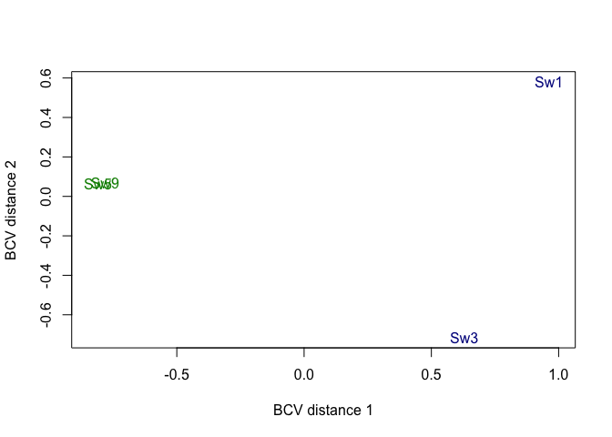<!-- -->

```r
#Estimating the Dispersion
d1 <- estimateCommonDisp(d, verbose=T)
```

```
## Disp = 0.0934 , BCV = 0.3056
```

```r
names(d1)
```

```
## [1] "counts"            "samples"           "common.dispersion"
## [4] "pseudo.counts"     "pseudo.lib.size"   "AveLogCPM"
```

```r
d1 <- estimateTagwiseDisp(d1)
names(d1)
```

```
##  [1] "counts"             "samples"            "common.dispersion" 
##  [4] "pseudo.counts"      "pseudo.lib.size"    "AveLogCPM"         
##  [7] "prior.df"           "prior.n"            "tagwise.dispersion"
## [10] "span"
```

```r
plotBCV(d1)
```

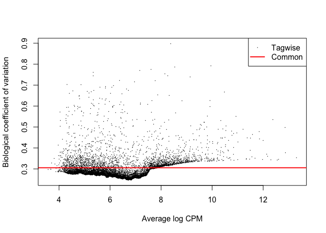<!-- -->

```r
#Differential Expression

et12 <- exactTest(d1, pair=c(1,2)) # compare groups 1 and 2

#FDR and save
DEG_out <- topTags(et12, n = "Inf")$table
Identifier_frame <- as.data.frame(Identifier)
DEG_out <- DEG_out[order(as.numeric(rownames(DEG_out))),,drop=FALSE]
Pairwise_results <- cbind(Identifier_frame, DEG_out)
colnames(Pairwise_results)[1] <- "Name"
write.table(Pairwise_results, "Pairwise_results.txt", row.names=FALSE, quote=FALSE, sep='\t')
UP_DOWN <- Pairwise_results[(Pairwise_results[,5]<0.05),]

UP <- UP_DOWN[(UP_DOWN[,2]>0),]
DOWN <- UP_DOWN[(UP_DOWN[,2]<0),]

UP <- UP[1]
DOWN <- DOWN[1]

write.table(UP, "UP.txt", row.names=FALSE, col.names = FALSE, quote=FALSE, sep='\t')
write.table(DOWN, "DOWN.txt", row.names=FALSE, col.names = FALSE, quote=FALSE, sep='\t')

de1 <- decideTestsDGE(et12, adjust.method="BH", p.value=0.05)
summary(de1)
```

```
##        Cyanomorph-Chloromorph
## Down                      390
## NotSig                   6916
## Up                        391
```

```r
# Taxonomy
Tax_unlisted <- unlist(Tax, use.names = FALSE)
plotSmear(et12, de.tags=Tax_unlisted, cex=0.7, col="grey")
abline(h = c(-2, 2), col = "blue")
```

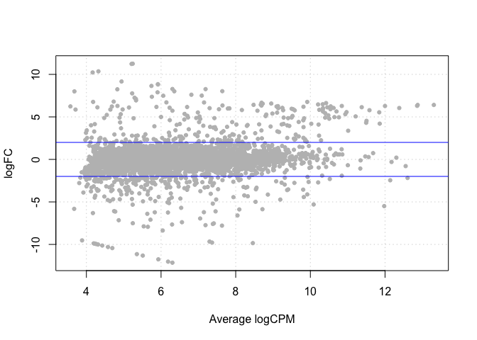<!-- -->

```r
# P-values , 0.05
de1tags12 <- rownames(d1)[as.logical(de1)] 
plotSmear(et12, de.tags=de1tags12, cex=0.7, col="grey")
abline(h = c(-2, 2), col = "blue")
```

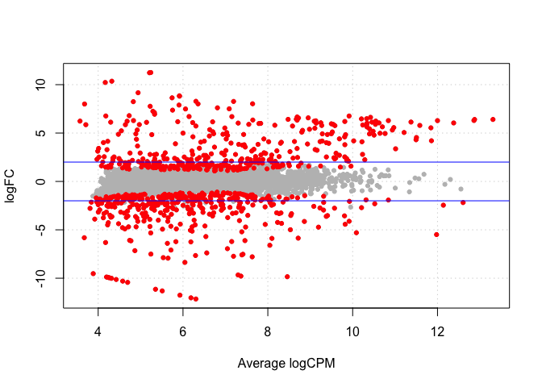<!-- -->

```r
n <- 19
palette_random <- distinctColorPalette(n)

p =ggplot(et12$table, aes(logCPM, logFC, col=Tax, text=Identifier)) + geom_point(alpha=0.55) + scale_colour_manual(values=c(palette_random))

q <- p + theme_bw() +
  #eliminates background, gridlines, and chart border
  theme(
    plot.background = element_blank()
    ,panel.grid.major = element_blank()
    ,panel.grid.minor = element_blank()
    ,panel.border = element_blank()
  ) +
  #draws x and y axis line
  theme(axis.line = element_line(color = "black")) + 
  #add horizontal lines
  geom_hline(yintercept=2, color = "grey") +
  geom_hline(yintercept=-2, color = "grey")

plot(q)
```

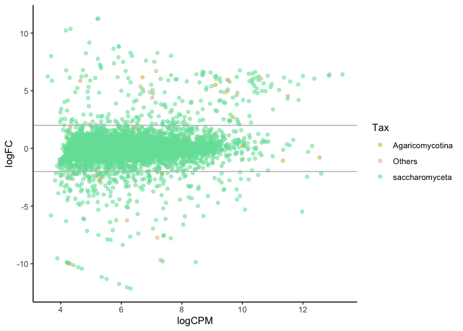<!-- -->

```r
# Uncomment for interactive graphs:
# ggplotly(q)
```

### Bacteria (no cyanobacteria)


```r
R script

directory <- "/Users/antoinesimon/Documents/Dendriscosticta/transcriptomics/NoteBook/Bacteria-no-cyano/"

outputPrefix <- "edgeR"
setwd(directory)
library(plyr)
library(edgeR)
library(ggplot2)
library(randomcoloR)
library(plotly)
library(bsselectR)
library(stringr)

sampleCondition <- c("Cyanomorph", 
                     "Cyanomorph", 
                     "Chloromorph", 
                     "Chloromorph")
                     
eXpress <- data.frame(read.table("results_ALL.txt",sep="\t", header = TRUE))

Tax <- data.frame(read.table("Tax_ALL.txt",sep="\t", header = FALSE))

Identifier <- data.frame(read.table("identifier.txt",sep="\t", header = FALSE))

#####edgeR
d <- DGEList(counts=eXpress,group=factor(sampleCondition))
d
```

```
## An object of class "DGEList"
## $counts
##   Sw1 Sw3 Sw5 Sw9
## 1   0   5   2   3
## 2   0   0   8   3
## 3   3   1   1   1
## 4   1  10   0   0
## 5   0   3   1   1
## 17195 more rows ...
## 
## $samples
##           group lib.size norm.factors
## Sw1  Cyanomorph   468744            1
## Sw3  Cyanomorph   589224            1
## Sw5 Chloromorph   592112            1
## Sw9 Chloromorph   488269            1
```

```r
dim(d)
```

```
## [1] 17200     4
```

```r
d.full <- d
head(d$counts)
```

```
##   Sw1 Sw3 Sw5 Sw9
## 1   0   5   2   3
## 2   0   0   8   3
## 3   3   1   1   1
## 4   1  10   0   0
## 5   0   3   1   1
## 6   1  10   0   0
```

```r
head(cpm(d))
```

```
##        Sw1       Sw3       Sw5      Sw9
## 1 0.000000  8.485737  3.377739 6.144154
## 2 0.000000  0.000000 13.510957 6.144154
## 3 6.400082  1.697147  1.688870 2.048051
## 4 2.133361 16.971474  0.000000 0.000000
## 5 0.000000  5.091442  1.688870 2.048051
## 6 2.133361 16.971474  0.000000 0.000000
```

```r
apply(d$counts, 2, sum)
```

```
##    Sw1    Sw3    Sw5    Sw9 
## 468744 589224 592112 488269
```

```r
keep <- rowSums(cpm(d)>20) >= 2
d <- d[keep,]
dim(d)
```

```
## [1] 2764    4
```

```r
Tax <- Tax[keep,]
Identifier <- Identifier[keep,]

d$samples$lib.size <- colSums(d$counts)
d$samples
```

```
##           group lib.size norm.factors
## Sw1  Cyanomorph   439799            1
## Sw3  Cyanomorph   486365            1
## Sw5 Chloromorph   521356            1
## Sw9 Chloromorph   434635            1
```

```r
#Normalizing the data
d <- calcNormFactors(d)
d
```

```
## An object of class "DGEList"
## $counts
##      Sw1  Sw3 Sw5 Sw9
## 26    45   59 461 218
## 61     1   14   0  13
## 89  6246 2711 425 533
## 127 1921 1145 117 140
## 135 1032 2782  98 170
## 2759 more rows ...
## 
## $samples
##           group lib.size norm.factors
## Sw1  Cyanomorph   439799    0.6375632
## Sw3  Cyanomorph   486365    1.0267543
## Sw5 Chloromorph   521356    1.1806952
## Sw9 Chloromorph   434635    1.2938157
```

```r
#Data Exploration

colors <- rep(c("green4", "blue4"), 2)
plotMDS(d, method="bcv", col=colors[d$samples$group])
```

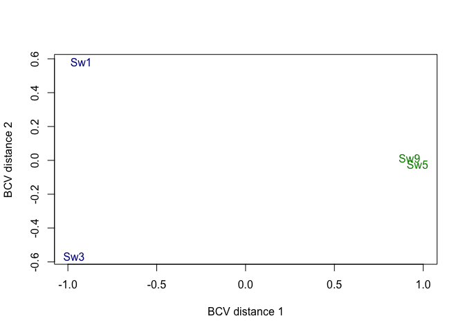<!-- -->

```r
#Estimating the Dispersion
d1 <- estimateCommonDisp(d, verbose=T)
```

```
## Disp = 0.44695 , BCV = 0.6685
```

```r
names(d1)
```

```
## [1] "counts"            "samples"           "common.dispersion"
## [4] "pseudo.counts"     "pseudo.lib.size"   "AveLogCPM"
```

```r
d1 <- estimateTagwiseDisp(d1)
names(d1)
```

```
##  [1] "counts"             "samples"            "common.dispersion" 
##  [4] "pseudo.counts"      "pseudo.lib.size"    "AveLogCPM"         
##  [7] "prior.df"           "prior.n"            "tagwise.dispersion"
## [10] "span"
```

```r
plotBCV(d1)
```

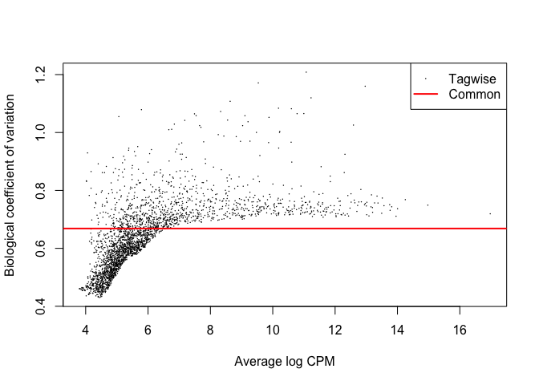<!-- -->

```r
#Differential Expression

et12 <- exactTest(d1, pair=c(1,2)) # compare groups 1 and 2

#FDR and save
DEG_out <- topTags(et12, n = "Inf")$table
Identifier_frame <- as.data.frame(Identifier)
DEG_out <- DEG_out[order(as.numeric(rownames(DEG_out))),,drop=FALSE]
Pairwise_results <- cbind(Identifier_frame, DEG_out)
colnames(Pairwise_results)[1] <- "Name"
write.table(Pairwise_results, "Pairwise_results.txt", row.names=FALSE, quote=FALSE, sep='\t')
UP_DOWN <- Pairwise_results[(Pairwise_results[,5]<0.05),]

UP <- UP_DOWN[(UP_DOWN[,2]>0),]
DOWN <- UP_DOWN[(UP_DOWN[,2]<0),]

UP <- UP[1]
DOWN <- DOWN[1]

write.table(UP, "UP.txt", row.names=FALSE, col.names = FALSE, quote=FALSE, sep='\t')
write.table(DOWN, "DOWN.txt", row.names=FALSE, col.names = FALSE, quote=FALSE, sep='\t')

de1 <- decideTestsDGE(et12, adjust.method="BH", p.value=0.05)
summary(de1)
```

```
##        Cyanomorph-Chloromorph
## Down                      609
## NotSig                   1728
## Up                        427
```

```r
# Taxonomy
Tax_unlisted <- unlist(Tax, use.names = FALSE)
plotSmear(et12, de.tags=Tax_unlisted, cex=0.7, col="grey")
abline(h = c(-2, 2), col = "blue")
```

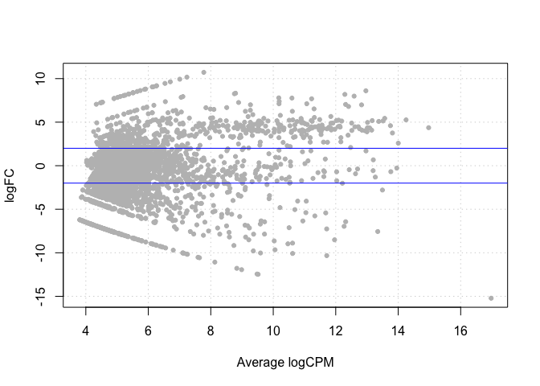<!-- -->

```r
# P-values , 0.05
de1tags12 <- rownames(d1)[as.logical(de1)] 
plotSmear(et12, de.tags=de1tags12, cex=0.7, col="grey")
abline(h = c(-2, 2), col = "blue")
```

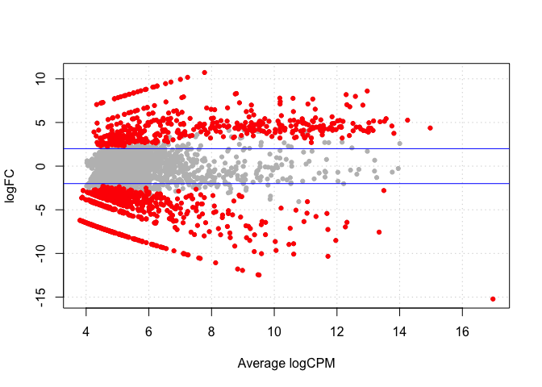<!-- -->

```r
n <- 19
palette_random <- distinctColorPalette(n)

p =ggplot(et12$table, aes(logCPM, logFC, col=Tax, text=Identifier)) + geom_point(alpha=0.55) + scale_colour_manual(values=c(palette_random))

q <- p + theme_bw() +
  #eliminates background, gridlines, and chart border
  theme(
    plot.background = element_blank()
    ,panel.grid.major = element_blank()
    ,panel.grid.minor = element_blank()
    ,panel.border = element_blank()
  ) +
  #draws x and y axis line
  theme(axis.line = element_line(color = "black")) + 
  #add horizontal lines
  geom_hline(yintercept=2, color = "grey") +
  geom_hline(yintercept=-2, color = "grey") #+

plot(q)
```

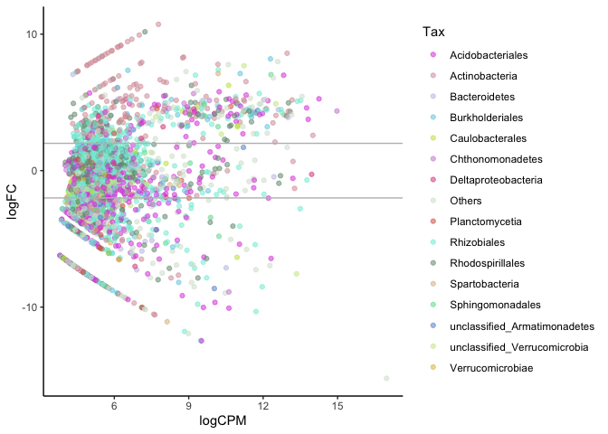<!-- -->

```r
# Uncomment for interactive graphs:
# ggplotly(q)
```

<a name="16"/>

## Plotting the abundance values of all Rhizobiales transcripts

The following chunks allow to build violin plots representing abundance values (based on total read counts estimated by [eXpress](https://pachterlab.github.io/eXpress/)) of all Rhizobiales transcripts of all four metatranscriptomes arranged by the number of individual metatranscriptomes in which they were recorded (i.e., four rows). Each individual plot shows sample (x) plotted against log mean abundance per transcript (y).


```python
# python script


import re
import sys

import fileinput

LineNumber = 0


OutFileName = 'Rhizobiales/binary-sw.txt'
OutFile=open(OutFileName, 'w')


filne = 'Rhizobiales/results_ALL.txt'


with open(filne, 'r+') as f:
	next(f) # skip header
	for Line in f:
		Column = Line.split('\t')
		sw1 = Column[0]
		sw3 = Column[1]
		sw5 = Column[2]
		sw9 = Column[3]

		All = 0
		if float(sw1) > 0:

			All += 1
		if float(sw3) > 0:

			All += 1
		if float(sw5) > 0:

			All += 1
		if float(sw9) > 0:

			All += 1
		
		OutputString = "%s\t%s\t" %(Line.replace("\n", ""), All)
		#print OutputString
		OutFile.write(OutputString+"\n")

f.close()
OutFile.close()

#add header
with file('Rhizobiales/binary-sw.txt', 'r') as original: data = original.read()
with file('Rhizobiales/binary-sw.txt', 'w') as modified: modified.write("Sw1\tSw3\tSw5\tSw9\tfreq\t\n" + data)
```


```r
# R script

directory <- "~/Documents/Dendriscosticta/transcriptomics/NoteBook/Rhizobiales/"
setwd(directory)

library(ggplot2)
library(reshape2)
library(tidyr)
```

```
## 
## Attaching package: 'tidyr'
```

```
## The following object is masked from 'package:reshape2':
## 
##     smiths
```

```r
library(dplyr)
```

```
## 
## Attaching package: 'dplyr'
```

```
## The following objects are masked from 'package:plyr':
## 
##     arrange, count, desc, failwith, id, mutate, rename, summarise,
##     summarize
```

```
## The following objects are masked from 'package:stats':
## 
##     filter, lag
```

```
## The following objects are masked from 'package:base':
## 
##     intersect, setdiff, setequal, union
```

```r
# possibly change the directory!
d <- read.delim(file="binary-sw.txt", header=TRUE, row.names = NULL)

d.long.df <- gather(d,            # data frame name 
                    key=sample,      # Name of new col that stores the old column names (that will be gathered)
                    value=transcript_abundance_values, # Name of new col that stores the old column values (that will be gathered)
                    # old columns to be gathered:
                    Sw1, Sw3, Sw5, Sw9)

d.long.df <- filter(d.long.df, !freq=="0")  

p<-ggplot(d.long.df, aes(sample, log10(transcript_abundance_values), color=sample)) +
  theme(axis.text.y = element_text(size = rel(0.5)))+
  theme(axis.text.x = element_text(size = rel(1), angle = 90))+
  facet_grid(rows = vars(freq))  + 
   geom_violin(scale = "count") +
  theme(
    plot.background = element_blank()
    ,panel.grid.major = element_blank()
    ,panel.grid.minor = element_blank()
    ,panel.border = element_blank()
  ) + 
  theme_minimal()

pdf("violin.pdf", height=5, width=7)
p+scale_color_manual(values=c("blue", "blue", "green","green"))
```

```
## Warning: Removed 3022 rows containing non-finite values (stat_ydensity).
```

```r
dev.off()
```

```
## quartz_off_screen 
##                 2
```

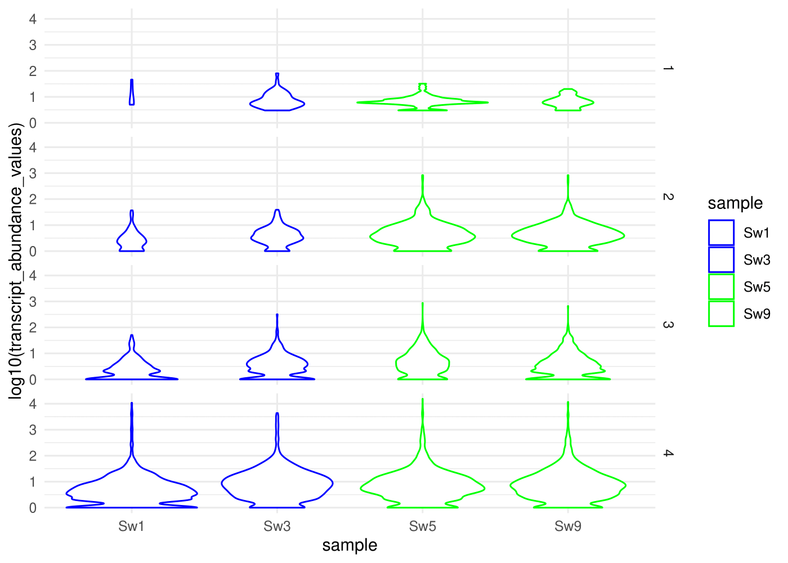<!-- -->

<a name="17"/>

## Creating an input file suitable for functional annotation

The Blast2GO methodology as implemented in [OmicsBox](https://www.biobam.com/omicsbox) was used to assign Gene Ontology (GO) terms to the transcripts.
But first, the DIAMOND blast results had to be generated in XML format, so that they can be directly loaded into the GUI.


```r
# R script

module load /isg/shared/modulefiles/diamond/0.9.9

diamond blastx -d ~/tempdata3/antoine/nt_diamond/nr -q ~/sw/transdecoder/Trinity.fasta.transdecoder.cds  -o ~/sw/Diamond_b2g_CDS.xml --taxonmap ~/home/antoine_simon/database/prot.accession2taxid.gz -e 1e-6 -p 8 -f 5 qseqid sseqid pident length mismatch gapopen qstart qend sstart send evalue bitscore staxids -k 1

for n in `cat sw/header_fungi.txt `; do LC_ALL=C fgrep "$n:" sw/Diamond_b2g_CDS.xml -B3 -A43 ; done > sw/Diamond_b2g_CDS_fungi.xml
```

<a name="18"/>

## Combining Gene Ontology (GO) and differential expressed genes (DEG)

The following script was used to combine the results of the GO enrichment and DEG analyses by building a heatmap displaying the most specific enriched Gene Ontology (GO) terms identified for statistically-significant fungal transcripts. Enriched terms and transcripts are organized by hierarchical clustering. DEG significance scores correspond to the logarithm of the fold change (logFC) between photomorphs (down: chloromorphs; up: cyanomorphs). GO term significance scores correspond the negative logarithm of P-values evaluating the significance of GO terms.


```r
# R script

#This chunk mostly follows the script written by Kevin Blighe on https://www.biostars.org/p/299161/ 

directory <- "/Users/antoinesimon/Documents/Dendriscosticta/transcriptomics/NoteBook/Fungi/"
setwd(directory)

library("ComplexHeatmap")
require("circlize")
library("viridis")

Pairwise_results <- cbind(Identifier_frame, DEG_out)
colnames(Pairwise_results)[1] <- "Name"

log2FCcutoff <- 0.05
BHcutoff <- 0.05
sigGeneList <- subset(Pairwise_results, abs(logFC)>=log2FCcutoff & PValue<=BHcutoff)[,1]

DAVIDfile <- "DEG_specific20for2_removed_too_general.txt"
DAVID <- read.table(DAVIDfile, sep="\t", header=TRUE)
colnames(DAVID)

names(DAVID)[3] <- "GO_Name"
names(DAVID)[6] <- "P_Value"
names(DAVID)[11] <- "TestSet_Sequences"
colnames(DAVID)
DAVID$TestSet_Sequences <- gsub(';', ', ', DAVID$TestSet_Sequences)
DAVID$TestSet_Sequences <- gsub('$', ', x', DAVID$TestSet_Sequences)
write.table(DAVID, "omicsbox_table2.txt", sep = "\t", row.names = FALSE, col.names = TRUE, quote = FALSE)
DAVIDfile <- "omicsbox_table2.txt"

#Enrichment cut-off
enrichBcutoff <- 1e-02 # should be way smaller
#DAVID <- subset(DAVID, P_Value<enrichBcutoff)
DAVID <- DAVID[,c(4,3,7,11)]

#Create a new dataframe that has '1' for when the gene is part of a term, and '0' when not
annGSEA <- data.frame(row.names=sigGeneList)
for (j in 1:length(sigGeneList))
{
  gene <- sigGeneList[j]
  pattern <- paste("^", gene, ", |, ", gene, "$| ", gene, ",", sep="")
  for (k in 1:nrow(DAVID))
  {
    if (any(grepl(pattern, DAVID$TestSet_Sequences[k])))
    {
      annGSEA[j,k] <- 1
    }
    else
    {
      annGSEA[j,k] <- 0
    }
  }
}
colnames(annGSEA) <- DAVID[,2]

#Remove terms with no overlapping genes
annGSEA <- annGSEA[,apply(annGSEA, 2, mean)!=0]

#Remove genes with no overlapping terms
annGSEA <- annGSEA[apply(annGSEA, 1, mean)!=0,]

#Match the order of rownames in DESeq_output with that of annGSEA
Pairwise_results <- Pairwise_results[which(Pairwise_results$Name %in% rownames(annGSEA)),]
Pairwise_results <- Pairwise_results[match(rownames(annGSEA), Pairwise_results$Name),]

#Set text and figure dimensions
geneLab=6
termLab=8

#Create heatmap annotations
#Color bar for fold changes
dfMinusLog10FDRGenes <- data.frame(abs(Pairwise_results[which(Pairwise_results[,1] %in% rownames(annGSEA)),"logFC"]))
dfMinusLog10FDRGenes[dfMinusLog10FDRGenes=="Inf"] <- 0
dfFoldChangeGenes <- data.frame(Pairwise_results[which(Pairwise_results[,1] %in% rownames(annGSEA)),"logFC"])
dfGeneAnno <- data.frame(dfMinusLog10FDRGenes, dfFoldChangeGenes)
dfGeneAnno[,2] <- ifelse(dfGeneAnno[,2]>0, "Cyanomorph", "Chloromorph")
colnames(dfGeneAnno) <- c("DEG\nsignificance\nscore", "Regulation")
colours <- list("Regulation"=c("Cyanomorph"="blue4", "Chloromorph"="green4"))
haGenes <- rowAnnotation(df=dfGeneAnno, col=colours, width=unit(1,"cm"))

#Color bar for GO Term significance score
dfMinusLog10BenjaminiTerms <- data.frame(-log10(read.table(DAVIDfile, sep="\t", header=TRUE)[which(read.table(DAVIDfile, sep="\t", header=TRUE)$GO_Name %in% colnames(annGSEA)),"P_Value"]))
colnames(dfMinusLog10BenjaminiTerms) <- "GO Term\nsignificance\nscore"
col_viridis = colorRamp2(c(2.63, 1.2), viridis(2)) 
haTerms <- HeatmapAnnotation(df = dfMinusLog10BenjaminiTerms, col = list(`GO Term
significance
score` = col_viridis), colname=anno_text(colnames(annGSEA), rot=40, just="right", location=unit(1,"npc")-unit(2,"mm"), gp=gpar(fontsize=termLab)), annotation_height=unit.c(unit(1, "cm"), unit(8, "cm")))

pdf("GO.pdf", width=12, height=10)
hmapGSEA <- Heatmap(annGSEA,
                    
                    name="My enrichment",
                    
                    split=dfGeneAnno[,2],
                    
                    col=c("0"="white", "1"="grey45"),
                    
                    rect_gp=gpar(col="grey85"),
                    
                    cluster_rows=T,
                    show_row_dend=T,
                    row_title="Statistically-significant genes",
                    row_title_side="left",
                    row_title_gp=gpar(fontsize=12, fontface="bold"),
                    row_title_rot=0,
                    show_row_names=TRUE,
                    row_names_gp=gpar(fontsize=geneLab, fontface="bold"),
                    row_names_side="left",
                    row_names_max_width=unit(15, "cm"),
                    row_dend_width=unit(10,"mm"),
                    
                    cluster_columns=T,
                    show_column_dend=T,
                    column_title="Enriched terms",
                    column_title_side="top",
                    column_title_gp=gpar(fontsize=12, fontface="bold"),
                    column_title_rot=0,
                    show_column_names=FALSE,
                    show_heatmap_legend=FALSE,
                    
                    clustering_distance_columns="euclidean",
                    clustering_method_columns="ward.D2",
                    clustering_distance_rows="euclidean",
                    clustering_method_rows="ward.D2",
                    
                    bottom_annotation=haTerms)

draw(hmapGSEA + haGenes, heatmap_legend_side="right", annotation_legend_side="right")
dev.off()
```

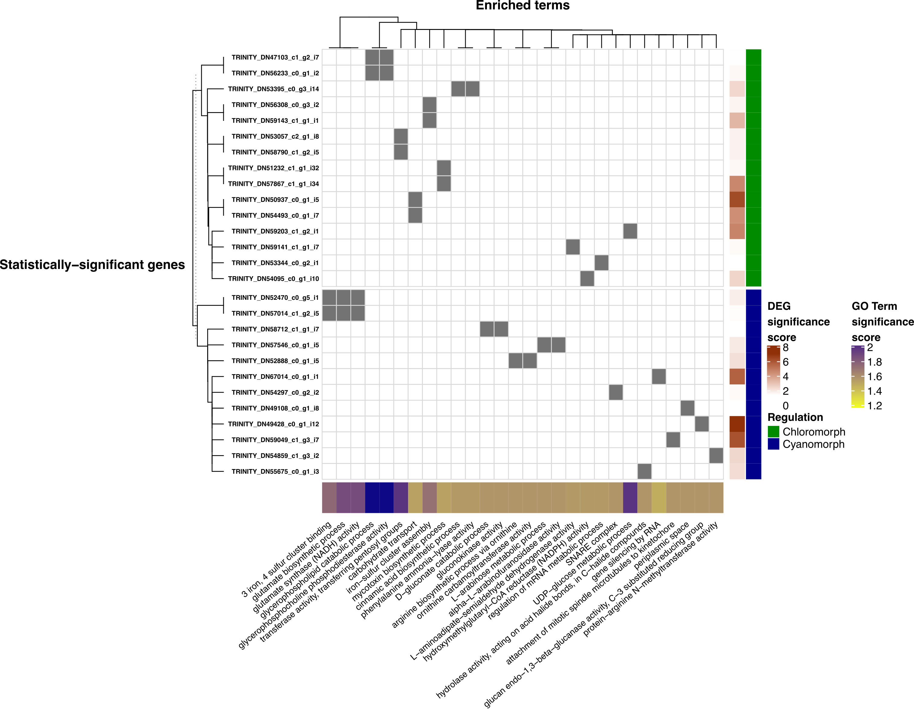<!-- -->
